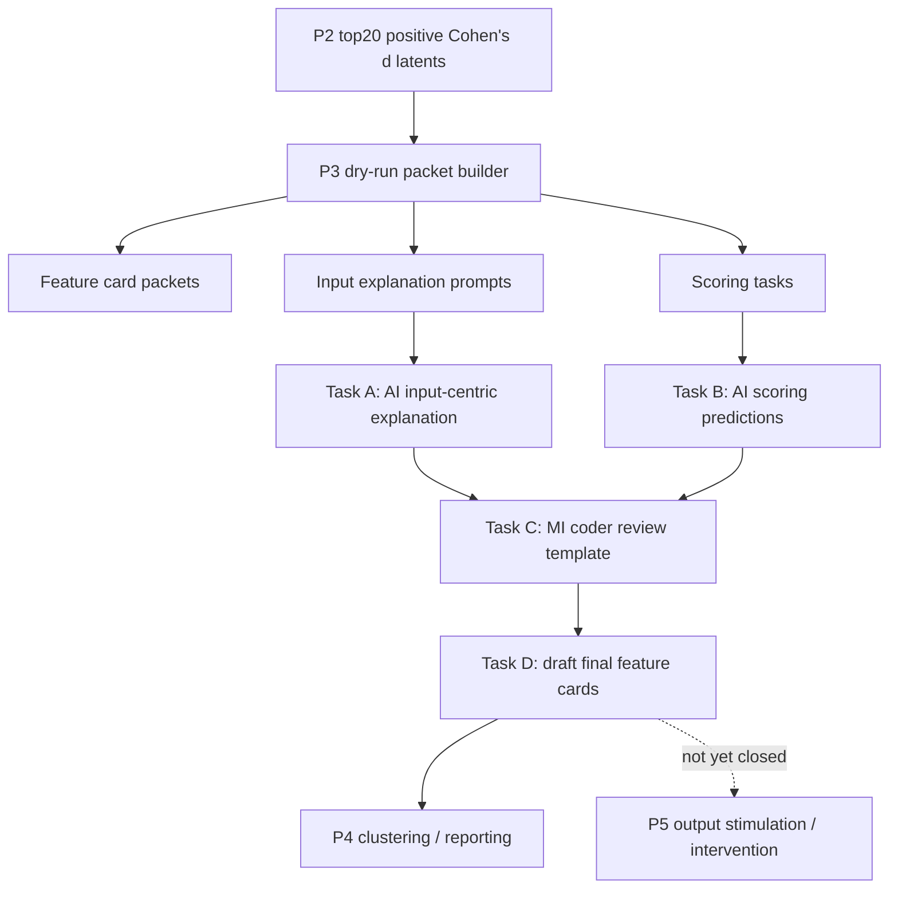

# P3 流程详解：从 SAE latent 到可审计 feature card

本文档解释当前项目中的 P3 流程：它为什么存在、每一步做什么、输入输出在哪里、结果应该如何读，以及哪些结论不能过度声称。

更新时间：2026-06-30  
仓库路径：`D:/project/NLP_re_dataset_model_base`

---

## 1. 一句话概括

P3 的目标是把 P2 筛出的 MISC 标签相关 SAE latents，整理成可由 AI 和人工共同审阅的 feature cards。

换句话说，P3 不是重新训练模型，也不是证明 SAE feature 有因果作用；它做的是：

```text
候选 SAE latent
→ 收集高激活/对照语句
→ 让 AI 给出谨慎解释
→ 用 held-out examples 检查解释是否有预测力
→ 生成 MI coder 可审核的 feature card 草稿
```

最终 P3 回答的问题是：

```text
这些 SAE latents 看起来捕捉到了哪些与 MISC 标签相关的输入模式？
这些模式更像表面形式、对话功能、MI 原则、上下文关系，还是数据 artifact？
```

它暂时不能回答：

```text
这个 latent 是否因果性地控制了模型输出？
LLM 是否真正理解了 MISC？
这个 feature 是否就是 QUO / RES / REC 等临床概念本身？
```

---

## 2. P3 在整个研究链条中的位置

当前项目大致分为以下阶段：

| 阶段 | 作用 | 当前 P3 的关系 |
|---|---|---|
| P1 | 准备 MISC 数据、标签矩阵、LLM activation / SAE feature | P3 依赖这些基础数据 |
| P2 | 找到与标签相关的 SAE latents，例如 top Cohen's d latents | P3 的候选 latent 来源 |
| P3 | 自动解释、评分、人工审核模板、feature cards | 本文档解释的核心 |
| P4 | latent 聚类、概念簇总结 | 需要 P3 card 作为输入 |
| P5 | ablation / steering / output stimulation | 用于更强机制或因果证据 |

P3 的证据等级应该被理解为：

```text
candidate interpretation / predictive sufficiency / audit material
```

而不是：

```text
causal mechanism / concept proof / clinical coding proof
```

---

## 3. 当前 P3 的输入

P3 的主输出目录是：

```text
outputs/misc_full_sae_eval/interpretability/p3_feature_cards
```

P3 dry-run 生成脚本默认读取以下输入：

| 输入 | 路径 | 作用 |
|---|---|---|
| Top20 latent 表 | `outputs/misc_full_sae_eval/interpretability/top20_cohensd_latent_utterances/top20_cohensd_latents_by_label.csv` | 每个 MISC 标签取正向 Cohen's d 最高的 20 个 SAE latents |
| Evidence packets | `outputs/misc_full_sae_eval/interpretability/top20_cohensd_latent_utterances/latent_evidence_packets/latent_evidence_packets_labeled.jsonl` | 每个 latent 的高激活、非目标高激活、随机目标样例 |
| SAE feature store | `outputs/misc_full_sae_eval/feature_store/utterance_features.pt` | 每条 counselor utterance 的 SAE feature activation |
| 标签矩阵 | `outputs/misc_full_sae_eval/label_matrix.csv` | 每条 utterance 的 MISC 标签 |
| 原始记录 | `outputs/misc_full_sae_eval/records.jsonl` | utterance 文本、record id、source metadata |
| 层选择 | `outputs/layer_selection_strategy/llama_layer_selection.csv` | 当前 SAE 对应 Llama layer 19，并记录层选择信息 |

当前 P3 覆盖 9 个核心标签：

```text
RE, RES, REC, QU, QUO, QUC, GI, SU, AF
```

每个标签 20 个 latents，总计：

```text
9 labels x 20 latents = 180 feature cards
```

重要限制：

```text
当前第一阶段只有 counselor current utterance，没有前一句 client utterance。
所以 RES / REC / RE 等依赖上下文的标签，不能仅凭当前 P3 证据强称为“反射了来访者内容”。
```

---

## 4. P3 总体流程图



---

## 5. Step 0：生成 P3 dry-run 材料

脚本：

```text
run_misc_p3_feature_cards.py
```

运行命令：

```powershell
python run_misc_p3_feature_cards.py
```

这个脚本不调用 LLM。它只负责把前面阶段的 latent evidence 组织成后续 AI 可以处理的材料。

主要输出：

| 文件/目录 | 作用 |
|---|---|
| `manifest.json` | dry-run 总清单 |
| `p3_feature_card_packets.jsonl` | 每个 latent 一个完整 card packet |
| `p3_feature_card_examples.csv` | 所有样例展开成表格 |
| `p3_feature_card_summary.csv` | 每个 latent 一行摘要 |
| `p3_input_explanation_prompts/` | Task A 要用的 180 个解释 prompt |
| `p3_scoring_tasks.jsonl` | Task B 要用的 360 个评分任务 |
| `p3_feature_cards_dryrun.md` | dry-run 总览报告 |

当前 dry-run 数量：

```text
n_cards: 180
n_prompts: 180
n_scoring_tasks: 360
n_example_rows: 12400
n_fallback_packets: 17
n_missing_packets: 0
```

17 个 fallback packets 都来自 `RES rank 4-20`。原因是旧的 phase1 evidence packet 与最新 top20 latent 表不完全同步，脚本从 feature store、label matrix 和 records 中现场重建了这些 RES packets。

---

## 6. Feature card packet 里有什么

文件：

```text
outputs/misc_full_sae_eval/interpretability/p3_feature_cards/p3_feature_card_packets.jsonl
```

每一行对应一个 latent。核心字段可以这样理解：

| 字段 | 含义 |
|---|---|
| `packet_id` | P3 内部 card id |
| `target_label` | 该 latent 是为哪个 MISC 标签筛出来的 |
| `latent_idx` | SAE latent 编号 |
| `rank_within_label` | 在该标签 top20 里的排名 |
| `association_metrics` | P2 阶段的 Cohen's d、directional AUC、precision@50 等 |
| `layer_metadata` | 当前 SAE 所在层和层选择信息 |
| `examples` | top activating、contrast、low activation 等样例 |
| `dry_run_explanation_slots` | 等待 Task A 填入的解释槽位 |
| `scoring_slots` | 等待 Task B 填入的评分槽位 |

其中 `examples` 的分组很重要：

| example group | 用途 |
|---|---|
| `top_activating` | 该 latent 激活最高的句子，用于归纳候选模式 |
| `high_non_target` | 非目标标签中也高激活的句子，用于发现混淆或 artifact |
| `random_target` | 目标标签正例随机样本，用于检查覆盖度 |
| `sibling_code_contrast` | 易混相邻标签对照，例如 QUO vs QUC、RES vs REC |
| `surface_matched_contrast` | 表面形式相似但不是目标标签的对照 |
| `low_activation_scoring` | 低激活样例，用于后续 scoring |

直观理解：

```text
top_activating 告诉你：这个 latent 喜欢什么。
contrast examples 告诉你：它可能也会误喜欢什么。
low_activation examples 告诉你：它不喜欢什么。
```

---

## 7. Task A：Input-centric explanation

Task A 的目标是让 AI 看每个 latent 的样例，然后给出一个谨慎解释。

输入：

```text
outputs/misc_full_sae_eval/interpretability/p3_feature_cards/p3_input_explanation_prompts/
```

输出：

```text
outputs/misc_full_sae_eval/interpretability/p3_feature_cards/ai_reviews/p3_input_explanations.jsonl
outputs/misc_full_sae_eval/interpretability/p3_feature_cards/ai_reviews/p3_input_explanations.csv
```

Task A 每条结果主要包含：

| 字段 | 含义 |
|---|---|
| `one_sentence_tentative_interpretation` | 一句话候选解释 |
| `main_patterns` | 2-5 个重复模式 |
| `relationship_to_target_label` | 与目标 MISC 标签的关系 |
| `artifact_risk` | artifact 风险，通常为 low / medium / high |
| `evidence_quality` | 解释证据质量，通常为 high / medium / low / uninterpretable |
| `candidate_feature_name` | 谨慎候选名称 |
| `alternative_explanations` | 替代解释 |
| `recommended_followup_checks` | 后续验证建议 |
| `final_concise_conclusion` | 简短结论 |
| `parse_status` | 是否成功解析 |

当前 Task A 状态：

```text
n_prompts_found: 180
n_success: 180
n_failed: 0
parse_status=ok: 180
```

当前解释质量分布：

```text
high: 74
medium: 105
low: 1
```

artifact 风险分布：

```text
low: 44
medium: 113
high: 23
```

如何读 Task A：

```text
high evidence_quality 不等于“这个 latent 就是某概念”。
low artifact_risk 不等于“无 artifact”。
它们只是自动审阅的候选判断，后续仍需要人工审核和 contrastive validation。
```

---

## 8. Task B：Input scoring

Task B 的目标是检查 Task A 给出的解释是否有预测力。

它不是直接问 AI：

```text
这个 latent 是不是 QUO？
```

而是拆成两类评分任务：

| task_type | 要回答的问题 | 评价对象 |
|---|---|---|
| `activation_prediction_task` | 根据候选解释，AI 能否判断某条句子会不会高激活该 latent？ | feature behavior |
| `code_discrimination_task` | 根据候选解释，AI 能否判断某条句子是否属于目标 MISC 标签？ | label discrimination |

输入：

```text
outputs/misc_full_sae_eval/interpretability/p3_feature_cards/p3_scoring_tasks.jsonl
```

输出：

```text
outputs/misc_full_sae_eval/interpretability/p3_feature_cards/ai_scoring/p3_scoring_predictions.jsonl
outputs/misc_full_sae_eval/interpretability/p3_feature_cards/ai_scoring/p3_scoring_metrics_by_latent.csv
outputs/misc_full_sae_eval/interpretability/p3_feature_cards/ai_scoring/p3_scoring_metrics_by_label.csv
outputs/misc_full_sae_eval/interpretability/p3_feature_cards/ai_scoring/p3_scoring_metrics_overall.json
```

当前 Task B 状态：

```text
scoring tasks: 360
predictions: 5280 / 5280
schema check: 5280 / 5280 passed
```

整体指标：

```text
accuracy: 0.5326
precision: 0.4538
recall: 0.7000
f1: 0.5506
balanced_accuracy: 0.5583
tp: 1512
tn: 1300
fp: 1820
fn: 648
n: 5280
```

标签级指标：

| label | accuracy | F1 | recall | balanced accuracy |
|---|---:|---:|---:|---:|
| AF | 0.6483 | 0.5035 | 0.4458 | 0.6146 |
| GI | 0.6017 | 0.3191 | 0.2333 | 0.5403 |
| QU | 0.6750 | 0.7391 | 0.9208 | 0.6750 |
| QUC | 0.5300 | 0.5994 | 0.8792 | 0.5882 |
| QUO | 0.5517 | 0.6238 | 0.9292 | 0.6146 |
| RE | 0.4983 | 0.5474 | 0.7583 | 0.5417 |
| REC | 0.5433 | 0.6052 | 0.8750 | 0.5986 |
| RES | 0.4117 | 0.4107 | 0.5125 | 0.4285 |
| SU | 0.3617 | 0.4831 | 0.7458 | 0.4257 |

重要解释：

```text
Task B 不是最终 MISC 分类器。
它衡量的是“解释是否能帮助 AI 对 held-out examples 做判断”。
activation prediction 更接近 feature 本身；
code discrimination 更接近目标 MISC 标签。
```

当前已知限制：

```text
confidence 大量集中在 0.85 附近，因此 AUROC 不应作为主指标。
当前更适合看 accuracy、F1、precision、recall、balanced accuracy。
```

---

## 9. Task C：MI coder manual review template

Task C 的目标是把已有解释和评分指标整理成人工审核表。

脚本命令：

```powershell
python run_misc_p3_agent_orchestrator.py task-c run
```

输出：

```text
outputs/misc_full_sae_eval/interpretability/p3_feature_cards/manual_review/p3_mi_coder_review_template.csv
```

当前状态：

```text
rows: 180
```

这个文件的作用是给人工 MI coder 或研究者补充审核判断，例如：

```text
这个 candidate name 是否合理？
这个 latent 更像功能线索还是表面 artifact？
RES/REC 是否因缺少 client context 而无法判定？
是否应保留为 robust candidate、降级为 mixed，或标记 artifact？
```

注意：

```text
当前 manual review template 不是已经完成的人工审核。
它只是给人工审核准备好的表。
```

---

## 10. Task D：Draft final feature cards

Task D 把以下材料合并：

```text
P3 card packet
Task A explanation
Task B scoring metrics
Task C manual review template
```

生成最终草稿 feature cards。

脚本命令：

```powershell
python run_misc_p3_agent_orchestrator.py task-d run
```

输出：

```text
outputs/misc_full_sae_eval/interpretability/p3_feature_cards/final_cards/p3_final_feature_cards.jsonl
outputs/misc_full_sae_eval/interpretability/p3_feature_cards/final_cards/p3_final_feature_cards.csv
outputs/misc_full_sae_eval/interpretability/p3_feature_cards/final_cards/p3_final_feature_cards.md
outputs/misc_full_sae_eval/interpretability/p3_feature_cards/final_cards/p3_label_summary.csv
outputs/misc_full_sae_eval/interpretability/p3_feature_cards/final_cards/p3_concept_cluster_seed_table.csv
```

当前状态：

```text
final cards: 180
Markdown report: exists
review_status: manual_draft
n_seeds_extracted: 0
```

final card 中常见字段：

| 字段 | 含义 |
|---|---|
| `candidate_feature_name` | Task A 给出的候选名称 |
| `input_centric_explanation` | 输入侧解释 |
| `activation_prediction_accuracy` | 根据解释预测 latent 高激活的准确率 |
| `code_discrimination_accuracy` | 根据解释区分目标标签的准确率 |
| `artifact_risk` | artifact 风险 |
| `evidence_quality` | 证据质量 |
| `final_status` | 当前自动状态，例如 robust_code_candidate / mixed_unclear / surface_artifact |
| `limitations` | 解释限制 |

当前 final status 分布：

```text
robust_code_candidate: 44
mixed_unclear: 113
surface_artifact: 23
```

标签级 final status：

| label | total | robust_code_candidate | surface_artifact | mixed_unclear |
|---|---:|---:|---:|---:|
| AF | 20 | 2 | 4 | 14 |
| GI | 20 | 5 | 1 | 14 |
| QU | 20 | 9 | 0 | 11 |
| QUC | 20 | 2 | 2 | 16 |
| QUO | 20 | 11 | 0 | 9 |
| RE | 20 | 1 | 2 | 17 |
| REC | 20 | 5 | 5 | 10 |
| RES | 20 | 2 | 3 | 15 |
| SU | 20 | 7 | 6 | 7 |

读法：

```text
robust_code_candidate:
    自动流程认为这个 latent 的解释较稳定、artifact 风险较低，适合优先人工复核。

mixed_unclear:
    可能混合了多个模式，或者与标签关系不够明确。

surface_artifact:
    更可能是问号、固定短语、转录模板、长度等表面特征。
```

---

## 11. 批处理执行器：run_misc_p3_agent_orchestrator.py

推荐把这个脚本作为 P3 的主执行入口。

它负责：

```text
1. 查看当前进度
2. 准备 Task A / Task B 小批次
3. 合并 batch output
4. 计算 Task B metrics
5. 生成 Task C / Task D
6. 执行全量 validate
```

常用命令：

```powershell
python run_misc_p3_agent_orchestrator.py status
python run_misc_p3_agent_orchestrator.py validate
```

继续下一批：

```powershell
python run_misc_p3_agent_orchestrator.py next-batch --batch-size 3
```

准备 Task A 小批次：

```powershell
python run_misc_p3_agent_orchestrator.py task-a prepare --label QUO --rank-min 1 --rank-max 5 --limit 2
```

合并 Task A：

```powershell
python run_misc_p3_agent_orchestrator.py task-a merge
python run_misc_p3_agent_orchestrator.py task-a validate
```

准备 Task B 小批次：

```powershell
python run_misc_p3_agent_orchestrator.py task-b prepare --label QUO --limit 2
```

合并并计算 Task B：

```powershell
python run_misc_p3_agent_orchestrator.py task-b merge
python run_misc_p3_agent_orchestrator.py task-b metrics
```

生成 Task C / D：

```powershell
python run_misc_p3_agent_orchestrator.py task-c run
python run_misc_p3_agent_orchestrator.py task-d run
python run_misc_p3_agent_orchestrator.py validate
```

当前 validate 结果：

```text
task_a_explanations_count: PASS
task_a_parse_ok_count: PASS
task_b_prediction_count: PASS
task_b_prediction_schema: PASS
task_b_metrics_by_latent: PASS
task_b_metrics_by_label: PASS
task_c_manual_review_template: PASS
task_d_final_cards: PASS
Overall: PASS
```

---

## 12. agent_batches 目录如何理解

批次目录：

```text
outputs/misc_full_sae_eval/interpretability/p3_feature_cards/agent_batches
```

每个 batch 通常有：

```text
task_a_batch_XXX_input.json
task_a_batch_XXX_instructions.md
task_a_batch_XXX_output.json

task_b_batch_XXX_input.json
task_b_batch_XXX_instructions.md
task_b_batch_XXX_output.json
```

`*_input.json` 是 AI 要读的任务输入。  
`*_instructions.md` 是给当前 AI 或另一个 AI 的操作说明。  
`*_output.json` 是 AI 处理后写回的结果。

正式使用时建议：

```text
一批只处理少量 latents，便于审查、恢复和定位错误。
```

不建议：

```text
一次性让 AI 读完全部 180 prompts 或 360 scoring tasks。
```

---

## 13. 当前 agent 启动入口：启动p3

P3 不再使用独立脚本调用外部模型服务。Task A / Task B 的解释和评分由当前对话模型完成，Python 脚本只负责生成 batch 文件、合并输出、计算指标和做数量校验。

推荐入口：

```powershell
python run_misc_p3_agent_orchestrator.py 启动p3 --batch-size 3
```

也可以用英文别名：

```powershell
python run_misc_p3_agent_orchestrator.py start-p3 --batch-size 3
```

这个入口会：

```text
1. 检查 P3 dry-run 输入是否存在
2. 如果 Task A 未完成，生成下一批 explanation batch
3. 如果已有 Task A output，先 merge 再继续
4. 如果 Task B 未完成，生成下一批 scoring batch
5. 如果已有 Task B output，先 merge 并计算 metrics
6. Task A/B 完成后运行 Task C / Task D / validate
```

关键点：

```text
脚本不会读取模型 API key。
脚本不会联网调用模型。
推理过程由当前对话模型或另一个接手 agent 读取 batch input 后完成。
agent 写回 task_a_batch_*_output.json 或 task_b_batch_*_output.json 后，再次运行“启动p3”即可继续。
```

---

## 14. 如何检查 P3 是否健康

第一步：

```powershell
python run_misc_p3_agent_orchestrator.py status
```

应该看到：

```text
Task A: COMPLETE
Task B: COMPLETE
Task C: GENERATED
Task D: GENERATED
Pipeline complete: True
```

第二步：

```powershell
python run_misc_p3_agent_orchestrator.py validate
```

应该看到：

```text
Overall: PASS
```

第三步：检查关键数量。

| 检查项 | 期望 |
|---|---:|
| feature cards | 180 |
| prompts | 180 |
| scoring tasks | 360 |
| scoring predictions | 5280 |
| Task A parse ok | 180 |
| metrics_by_latent rows | 360 |
| metrics_by_label rows | 9 |
| manual review rows | 180 |
| final cards | 180 |

第四步：检查字段 schema。

Task B prediction 必须有：

```text
packet_id
target_label
latent_idx
task_type
row_idx
predicted
confidence
rationale_short
```

旧版本可能出现 `predicted_value` 而不是 `predicted`。当前 orchestrator 已兼容并在 merge 后规范化，但如果手工写文件，仍应使用 `predicted`。

---

## 15. 如何读 P3 的科研含义

当前结果最稳妥的读法：

```text
P3 发现了一批 MISC 标签相关的 SAE latent 候选解释。
这些解释中，一部分更接近稳定对话功能，一部分更像表面形式或 artifact。
不同 MISC 标签的可解释性不同。
```

当前比较有价值的观察：

1. `QU` 和 `QUO` 的解释质量相对较高，说明问题类标签更容易被稳定句法和对话功能捕捉。
2. `QUO` 与 `QUC` 的区别常常落在 wh-question、auxiliary question、open-ended invitation 等边界上。
3. `RES / REC / RE` 因缺少前一句 client context，解释更容易退化为表面模板或短语线索。
4. `GI` 的 robust candidates 经常与医学/健康信息、事实解释、用药建议等内容相关。
5. `SU` 的 robust candidates 经常与理解、支持、困难确认、帮助承诺等措辞相关。
6. `AF` 的候选模式常与明确正向评价、感谢、认可努力相关。

这些可以形成论文中的候选表述：

```text
The SAE feature space yields auditable candidate patterns associated with MISC counselor behavior labels.
Question-related labels show relatively clearer surface-functional structure, whereas reflection-related labels require missing client context for stronger interpretation.
```

不建议写成：

```text
The SAE proves the model understands MISC.
This latent is a QUO feature.
The top activating examples demonstrate a causal mechanism.
```

---

## 16. 当前结果的主要限制

### 16.1 缺少前一句 client context

这会显著影响：

```text
RE
RES
REC
```

因为反射类标签本质上要看 counselor utterance 是否复述、改写或深化了前一句 client 内容。只看 counselor 当前句，最多能说：

```text
该 latent 似乎捕捉到了 reflection-like phrasing。
```

不能说：

```text
该 latent 捕捉到了真实 client-content mirroring。
```

### 16.2 Task B confidence 过于集中

当前大多数 prediction 的 confidence 接近 `0.85`，所以 AUROC 不能作为主证据。建议主要参考：

```text
accuracy
F1
precision
recall
balanced accuracy
```

### 16.3 final cards 仍是 manual_draft

`final_cards/manifest.json` 中：

```text
review_status: manual_draft
```

这意味着：

```text
已有自动 feature card 草稿。
尚未完成真正 MI coder 人工审核。
```

### 16.4 output stimulation 尚未闭环

当前 P3 没有完成：

```text
SAE decoder intervention
feature stimulation
target/sibling logit change
ablation / steering
```

因此不能声称因果作用。

---

## 17. 建议的人工审核顺序

优先审核：

```text
final_status = robust_code_candidate
artifact_risk = low
evidence_quality = high 或 medium
```

当前共有：

```text
robust_code_candidate: 44
```

建议按标签优先级：

1. `QUO / QU / QUC`：最适合做“问题类标签边界”分析。
2. `GI / SU / AF`：适合做“信息提供、支持、肯定”的功能解释。
3. `REC / RES / RE`：需要等加入 client context 后再做强解释。

人工审核时每张 card 至少问：

```text
1. 候选名称是否过度概念化？
2. top activating examples 是否真的共享模式？
3. high_non_target 是否揭示混淆？
4. 这个模式是 surface-form 还是 dialogue-function？
5. 是否可能只是转录模板、长度、固定短语或数据来源 artifact？
6. 是否需要降级为 mixed_unclear 或 surface_artifact？
```

---

## 18. 下一步建议

### 短期

1. 固定当前 P3 状态，避免继续用不同 runner 反复覆盖结果。
2. 对 44 个 robust candidates 做人工二次审核。
3. 为 `QU / QUO / QUC` 写一个专题分析报告。
4. 对 Task B 的 confidence calibration 做修正，减少 AUROC 不可用的问题。

### 中期

1. 给 evidence packets 增加前一句 client utterance。
2. 重新分析 `RES / REC / RE`。
3. 对 robust candidates 做 contrastive minimal pairs。
4. 生成 P4 latent cluster，总结跨标签共享模式。

### 长期

1. 实现 P5 output stimulation。
2. 做 SAE feature ablation / steering。
3. 检查 feature intervention 是否影响 MISC probe 或模型生成行为。
4. 把 P3 解释、P4 cluster、P5 intervention 串成更强机制证据链。

---

## 19. 推荐阅读顺序

如果你只是想快速理解 P3：

```text
1. 本文档
2. outputs/misc_full_sae_eval/interpretability/p3_feature_cards/manifest.json
3. outputs/misc_full_sae_eval/interpretability/p3_feature_cards/final_cards/p3_label_summary.csv
4. outputs/misc_full_sae_eval/interpretability/p3_feature_cards/final_cards/p3_final_feature_cards.md
```

如果你要接手执行：

```text
1. doc/P3_AI流水线评估与自动化实现指南.md
2. run_misc_p3_agent_orchestrator.py
3. outputs/misc_full_sae_eval/interpretability/p3_feature_cards/agent_batches/
```

如果你要写论文：

```text
1. final_cards/p3_final_feature_cards.csv
2. final_cards/p3_label_summary.csv
3. ai_scoring/p3_scoring_metrics_by_label.csv
4. selected robust_code_candidate cards
```

---

## 20. 最终结论

当前 P3 已经完成了 input-centric 自动解释、held-out scoring、人工审核模板和 draft final cards。数量和 schema 校验通过，可以作为后续人工审核和论文 case analysis 的基础。

但它仍然是解释性候选证据，而不是因果机制证明。最稳妥的科研表述是：

```text
SAE latents expose auditable candidate patterns associated with MISC counselor behavior labels.
These patterns vary by label family: question labels show clearer surface-functional regularities, while reflection labels require additional client context for stronger interpretation.
```
