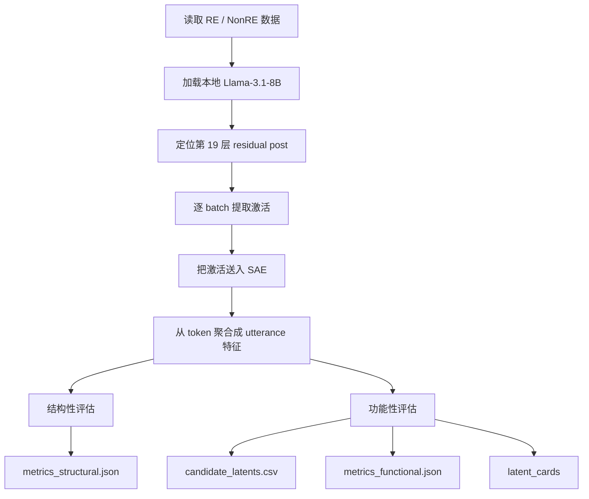

# SAE-RE 项目小白讲解总文档

这份文档的目标不是“复述代码”，而是把这个项目翻译成**普通人也能跟上的自然语言**。

如果你是第一次接触 SAE、latent、hook、机制解释，也没关系。你只需要把它看成一条研究流水线：

- 先让大模型读文本
- 再把模型中间层的内部想法抓出来
- 再用 SAE 把这些“混在一起的内部想法”拆成很多更稀疏的小特征
- 最后看看哪些小特征和 RE（反射性倾听）关系最密切

---

## 先看说明标签

为了避免把“代码里真的这样写了”和“我对设计原因的解释”混在一起，全文会用三种标签：

- **[代码事实]**：可以直接在当前代码里找到。
- **[实验事实]**：可以直接在当前输出文件或日志里找到。
- **[解释性推断]**：这是基于代码和研究目的做出的解释，不是代码自己写出来的话。

---

## 1. 项目一句话说明

### 1.1 这个项目到底想研究什么

**[代码事实]** 这个项目想回答的问题是：

> 当本地 `Llama-3.1-8B` 读入 RE 和 NonRE 文本时，它在第 19 层 residual stream 里，是否存在一些能代表 “RE 概念” 的典型稀疏特征？

换句话说，它不是只想知道“模型能不能分出 RE 和 NonRE”，而是想进一步问：

> 模型内部有没有一些比较稳定、比较像“反射性倾听”的特征单元？

### 1.2 RE、NonRE、SAE、latent、hook point 分别是什么

- **RE**
  - 反射性倾听（Reflective Listening）。
  - 你可以先把它理解成一种对话风格：说话者不是只给建议，而是在理解、复述、澄清对方的感受和意思。

- **NonRE**
  - 不是 RE 的文本。
  - 在这个项目里，它是 RE 的对照组。

- **SAE**
  - Sparse Autoencoder，中文常叫“稀疏自编码器”。
  - 你可以先把它理解成一个“拆分器”：它把模型中间一大坨很复杂的激活，拆成很多更稀疏的小特征。

- **latent**
  - SAE 拆出来的“隐藏特征”。
  - 你可以把它想象成“一个可能代表某种语义或模式的小开关”。
  - 它不是人类直接写死的标签，而是 SAE 从数据里学出来的特征槽位。

- **hook point**
  - hook point 就是“你要从模型哪里把中间激活抓出来”。
  - 这个项目抓的是 `blocks.19.hook_resid_post`，也就是第 19 层 transformer block 之后的 residual stream。

### 1.3 这条管线最后想得到什么结果

**[代码事实]** 这条管线最后主要想得到两类结果：

1. **结构性结果**
   - SAE 重建得像不像原始激活
   - SAE 有多稀疏
   - 有多少 latent 是“活的”，多少 latent 是“死的”

2. **功能性结果**
   - 哪些 latent 和 RE / NonRE 区分最明显
   - 这些 latent 是否值得进一步人工解释
   - 这些 latent 是否真的对分类判断有帮助

**[实验事实]** 就当前仓库里已经存在的正式输出看，项目已经稳定产出了：

- `metrics_structural.json`
- `candidate_latents.csv`

但还**没有稳定产出**：

- `metrics_functional.json`
- `latent_cards/`

这意味着：候选 latent 已经筛出来了，但完整功能评估还没有在已有正式产物里稳定落地。

---

## 2. 整体流程总览

### 2.1 用一句人话先讲完整条流程

这条管线做的事情，可以用一句很直白的话描述：

> 它先把 RE / NonRE 文本送进本地 Llama 模型，再把第 19 层的中间激活抓出来，接着用预训练 SAE 把这些激活拆成很多稀疏 latent，最后在句子级别比较哪些 latent 更像 RE。

### 2.2 Mermaid 流程图

### 2.3 哪些步骤已经稳定跑通，哪些还不稳定

**[实验事实]** 当前仓库里已有产物和运行报告支持下面这个结论：

已经稳定拿到产物的步骤：

- 读取数据
- 加载本地 Llama
- 下载并加载 SAE
- 抽取 layer 19 激活
- 运行 SAE
- 从 token 聚合到 utterance
- 计算结构性指标
- 生成 `candidate_latents.csv`

还没有在正式产物中稳定落地的步骤：

- 完整功能评估汇总
- MaxAct 卡片
- 最终 `metrics_functional.json`

**[解释性推断]** 所以当前项目更适合被理解为：

> “已经把候选 RE latent 找出来的研究原型”

而不是：

> “已经完整验证所有功能指标并得出最终机制结论的成熟系统”

---

## 3. 代码模块地图

下面这张表格是整仓库最重要的模块地图。你可以把它当成“角色表”。

| 模块 | 它像什么 | 输入是什么 | 输出是什么 | 为什么要存在 |
|---|---|---|---|---|
| `run_sae_evaluation.py` | 总导演 | 配置、数据路径、运行参数 | 全流程结果文件 | 把所有模块串起来 |
| `src/nlp_re_base/data.py` | 数据搬运工 | `re_dataset.jsonl`、`nonre_dataset.jsonl` | Python 里的记录列表 | 把 JSONL 读进来 |
| `src/nlp_re_base/model.py` | 基模加载器 | 本地模型路径、dtype、device_map | Llama 模型和 tokenizer | 负责把本地 Llama 真正加载好 |
| `src/nlp_re_base/sae.py` | SAE 构建器 | Hugging Face repo、subfolder、device、dtype | SAE 模型 | 下载 SAE 参数并构建可运行的 SAE |
| `src/nlp_re_base/activations.py` | 中间激活处理器 | 文本、模型、SAE、hook point | utterance 特征、sample 激活 | 抓激活、跑 SAE、做 streaming 聚合 |
| `src/nlp_re_base/eval_structural.py` | 结构评估器 | 原始激活、重建激活、latent、mask | 结构指标 JSON | 回答“SAE 工作得像不像一个合格的 SAE” |
| `src/nlp_re_base/eval_functional.py` | 功能评估器 | RE / NonRE 句级特征、原始句级激活、decoder 权重 | 候选 latent、probe 结果、功能指标 | 回答“哪些 latent 和 RE 概念有关” |

### 3.1 你可以把它理解成一条装配线

如果用工厂比喻，这条装配线是这样的：

- `data.py`：把原料搬上来
- `model.py`：启动大机器
- `sae.py`：装上拆分器
- `activations.py`：把机器内部产物抓出来、拆开、整理
- `eval_structural.py`：检查拆分器本身质量
- `eval_functional.py`：检查拆出来的东西有没有研究价值
- `run_sae_evaluation.py`：按顺序协调全部动作

---

## 4. 主流程逐步拆解

这一节最重要。我们不按“文件目录”讲，而按**程序真正执行的顺序**讲。

---

### 第 0 步：解析命令行参数

**入口文件**：`run_sae_evaluation.py`

**[代码事实]** 主程序支持这些关键运行参数：

- `--output-dir`
- `--batch-size`
- `--max-seq-len`
- `--device`
- `--skip-ce-kl`
- `--sae-config`
- `--model-config`
- `--data-dir`

**输入**

- 命令行参数

**做了什么**

- 决定这次实验把结果写到哪里
- 决定 batch 多大
- 决定最大截断长度
- 决定是否跳过 CE/KL

**输出**

- `args`

**为什么这样设计**

- **[解释性推断]** 把运行时参数放到命令行，是为了让同一套代码能做不同实验，而不用每次改源码。

**最容易误解的点**

- **[代码事实]** `sae_config.json` 里虽然有 `batch_size` 和 `max_seq_len`，但主程序实际优先使用命令行参数，默认值是：
  - `batch_size=4`
  - `max_seq_len=128`
- 所以不要以为 `sae_config.json` 里的 `batch_size=8` 一定会真的被主流程用到。

---

### 第 1 步：读取 SAE 配置

**相关文件**：`config/sae_config.json`

**输入**

- `sae_config.json`

**做了什么**

- 读出 SAE 仓库地址
- 读出 hook point
- 读出 `d_model`、`d_sae`
- 读出功能评估参数，比如 `fdr_alpha`、`probe_k_values`、`top_k_candidates`

**输出**

- `sae_config` 这个 Python 字典

**为什么这样设计**

- **[解释性推断]** 因为 SAE 相关参数很多，而且这些参数经常一起变化，放在 JSON 里比写死在代码里更方便管理。

**最容易误解的点**

- **[代码事实]** 这个配置文件里有两类参数：
  1. 真正参与运行逻辑的参数
  2. 更像“说明 SAE 身份”的参数

- 比如 `sae_repo_id`、`sae_subfolder`、`hook_point` 会直接影响加载与运行；
- `d_model`、`d_sae` 也在配置里，但真正构建 SAE 时，主程序还是会以 Hugging Face 上的 `hyperparams.json` 为准。

---

### 第 2 步：读取数据集

**相关文件**：`src/nlp_re_base/data.py`

**输入**

- `data/mi_re/re_dataset.jsonl`
- `data/mi_re/nonre_dataset.jsonl`

**做了什么**

- `load_jsonl()` 逐行读取 JSONL
- 主程序只取每条记录中的 `unit_text`
- 把 RE 文本和 NonRE 文本拼接起来
- 同时构造标签

**输出**

- `re_texts`
- `nonre_texts`
- `all_texts`
- `all_labels`

**几个关键变量**

- `re_texts`
  - 只包含 RE 的文本列表
- `nonre_texts`
  - 只包含 NonRE 的文本列表
- `all_texts`
  - `re_texts + nonre_texts`
  - 这就是后面真正送进模型的全部文本
- `all_labels`
  - 和 `all_texts` 一一对应
  - RE 用 `1`
  - NonRE 用 `0`

**[实验事实]** 当前数据条数是：

- RE：799
- NonRE：799
- 总数：1598

**为什么这样设计**

- **[解释性推断]** 先拼成一套统一顺序，后面所有模块都只要处理一份 `all_texts`，不需要一直分开维护两套数组，逻辑更简单。

**最容易误解的点**

- **[代码事实]** 当前代码只用 `unit_text`，没有把更长上下文、人工标注解释或别的字段送进模型。
- 所以这个项目当前研究的是：
  - “单条 utterance 是否像 RE”
- 不是：
  - “一整段多轮对话是否形成 RE 策略”

---

### 第 3 步：确定运行设备

**输入**

- 命令行 `--device`
- 或 `torch.cuda.is_available()`

**做了什么**

- 如果用户指定设备，就用用户指定的
- 否则优先用 `cuda`
- 再不行就退回 `cpu`

**输出**

- `device`

**为什么这样设计**

- **[解释性推断]** 这是大模型工程里非常常见的写法。优先 GPU 是因为 8B 模型 + SAE 的推理代价很高。

**最容易误解的点**

- 即使主程序选择了 `cuda`，基础模型和 SAE 实际上也可能因为 `device_map=auto` 分配到更细的设备布局上。

---

### 第 4 步：加载本地 Llama 模型

**相关文件**：`src/nlp_re_base/model.py`

**输入**

- `config/model_config.json`

**做了什么**

- 读取本地模型路径
- 读取 `torch_dtype`
- 读取 `device_map`
- 用 `AutoTokenizer.from_pretrained()` 加载 tokenizer
- 如果没有 `pad_token`，就把 `eos_token` 当 pad 用
- 用 `AutoModelForCausalLM.from_pretrained()` 加载基模

**输出**

- `model`
- `tokenizer`
- `model_cfg`

**为什么这样设计**

- **[解释性推断]** 研究重点不是重新训练 Llama，而是分析它的中间表示，所以直接加载本地现成模型最合理。

**最容易误解的点**

- SAE 不是替代 Llama 的模型。
- 这里的基础模型仍然是主角，SAE 只是一个“分析工具”。

---

### 第 5 步：加载 SAE

**相关文件**：`src/nlp_re_base/sae.py`

**输入**

- `sae_repo_id`
- `sae_subfolder`
- `device`
- `dtype=torch.bfloat16`（主程序里固定写死）

**做了什么**

1. 从 Hugging Face 下载 `hyperparams.json`
2. 读出 `d_model`、`d_sae`、threshold、norm_scale 等超参数
3. 构建本地 `SparseAutoencoder`
4. 下载 checkpoint 目录
5. 读取 `safetensors`
6. 把 checkpoint 键名映射到本地参数名
7. 检查关键权重是否缺失
8. 严格加载参数
9. 把 SAE 放到指定设备和 dtype 上

**输出**

- `sae`

**为什么这样设计**

- **[解释性推断]** 研究者想复用公开发布的 SAE，而不是自己从头训练一个 SAE。
- 这样一来，项目可以把更多精力放在“如何评估和解释 latent”，而不是“如何重新训练 SAE”。

**最容易误解的点**

- SAE 并不是凭空生成的。它是已经预训练好的，项目只是把它接进来使用。
- **[代码事实]** 当前加载逻辑是严格模式：关键权重缺失会直接报错，而不是悄悄用随机值继续跑。

---

### 第 6 步：抓取第 19 层激活，并立刻跑 SAE

**相关文件**：`src/nlp_re_base/activations.py`

这一段是整个项目最核心的工程部分。

#### 6.1 hook point 是怎么定位的

**输入**

- `hook_point="blocks.19.hook_resid_post"`

**做了什么**

- `_parse_hook_point()` 解析出层号 `19`
- 找到 `model.model.layers[19]`
- 在这个模块上注册 forward hook

**输出**

- 一个能在前向传播时抓到中间激活的 hook

#### 6.2 每个 batch 真正发生了什么

对每一个 batch，代码会做这些事：

1. tokenize 文本
2. 把 token 送入基础模型
3. hook 把第 19 层输出抓下来
4. 把激活转换成 SAE 的 dtype
5. 用 SAE 编码和重建
6. 把 token 级结果聚合成句子级结果
7. 只保留少量 token 级样本用于结构评估

#### 6.3 这一段的关键输出变量

- `utterance_features`
  - 形状大致是 `[N, d_sae]`
  - 它表示“每个句子在每个 latent 上有多强”

- `utterance_activations`
  - 形状大致是 `[N, d_model]`
  - 它表示“每个句子的原始中间激活”

- `sample_activations`
  - 只保留前几个 batch 的 token 级原始激活

- `sample_reconstructed`
  - 只保留前几个 batch 的 token 级 SAE 重建激活

- `sample_latents`
  - 只保留前几个 batch 的 token 级 latent

- `sample_mask`
  - 对应的 attention mask

#### 6.4 为什么不是把所有 token latent 都存下来

**[代码事实]** 这个项目采用的是 streaming 设计，而不是一次性存完整 `[N, T, d_sae]`。

**[解释性推断]** 原因很简单：内存太贵。

如果 1598 条样本、每条最多 128 token、每个 token 对应 32768 个 latent，都一次性存下来，张量会非常大。对单卡环境来说，这种做法不现实。

所以当前代码采用的策略是：

- token 级结果只在 batch 内短暂停留
- 很快聚合成句子级结果
- 真正常驻内存的是：
  - `utterance_features`
  - `utterance_activations`
  - 少量 sample

#### 6.5 为什么还要保留 `sample_*`

因为结构评估很多指标本来更适合看 token 级结果。

但项目又不想为结构评估保留全部 token 张量，所以采用折中方案：

- 只保留前几个 batch 的 token 级 sample
- 用这些 sample 估计结构指标

**最容易误解的点**

- 结构性指标不是在全量 token 上算出来的。
- 它们是**sample-based**，不是**full-token-based**。

---

### 第 7 步：从 RE / NonRE 切回两组句级特征

**输入**

- `utterance_features`
- `utterance_activations`

**做了什么**

- 按前面拼接顺序把前半段切为 RE，后半段切为 NonRE

**输出**

- `re_features`
- `nonre_features`
- `re_activations`
- `nonre_activations`

**为什么这样设计**

- **[解释性推断]** 前面统一跑一遍模型，后面再切组，是最省心也最不容易出错的做法。

**最容易误解的点**

- 这里“分组”发生在模型之后，不是在模型之前分两次单独跑。

---

### 第 8 步：做结构性评估

**相关文件**：`src/nlp_re_base/eval_structural.py`

**输入**

- `sample_activations`
- `sample_reconstructed`
- `sample_latents`
- `sample_mask`
- 可选的 `ce_kl_results`

**做了什么**

- 计算 MSE
- 计算 cosine similarity
- 计算 explained variance / FVU
- 计算 L0 稀疏性
- 计算 firing frequency / dead ratio
- 如果没跳过 CE/KL，还会计算输出分布偏移

**输出**

- `metrics_structural.json`

**为什么这样设计**

- **[解释性推断]** 在研究 latent 有没有意义之前，先确认 SAE 至少像一个“正常工作的 SAE”。

**最容易误解的点**

- 结构评估回答的是：
  - “SAE 重构得像不像”
- 它不直接回答：
  - “latent 是否真的代表 RE”

---

### 第 9 步：做功能性评估

**相关文件**：`src/nlp_re_base/eval_functional.py`

**输入**

- `re_features`
- `nonre_features`
- `all_texts`
- `all_labels`
- `re_activations`
- `nonre_activations`
- `sae_decoder_weight`

**做了什么**

功能性评估按顺序设计为：

1. `univariate_analysis()`
2. `sparse_probing()`
3. `maxact_analysis()`
4. `feature_absorption()`
5. `feature_geometry()`
6. `targeted_probe_perturbation()`

**输出**

- `candidate_latents.csv`
- 理想状态下还应有 `metrics_functional.json`
- 理想状态下还应有 `latent_cards/`

**为什么这样设计**

- **[解释性推断]** 因为 32768 个 latent 太多，先用单 latent 统计筛出候选，再做更贵、更细的分析，是更合理的研究流程。

**最容易误解的点**

- “功能评估实现了”不等于“功能评估已经稳定跑完并产出正式结果”。
- 当前仓库的正式输出里，只有 `candidate_latents.csv` 稳定存在。

---

## 5. 核心工程设计解释

这一节专门回答“为什么要这么设计”。

### 5.1 为什么要用本地基模 + 远程 SAE

**[代码事实]** 基础模型来自本地，SAE 参数来自 Hugging Face。

**[解释性推断]** 这样做的好处是：

- 大模型本体通常很大，本地已有一份就没必要重复下载
- SAE 可以复用公开研究团队已经训练好的版本
- 把“基础模型”和“解释工具”拆开，工程上更灵活

### 5.2 为什么 hook 在 layer 19 residual post

**[代码事实]** 当前配置写的是 `blocks.19.hook_resid_post`。

**[解释性推断]** 这一设计很可能有两个原因：

1. 这正好对应你引用的 SAE checkpoint 所训练的位置
2. 中后层 residual stream 通常比早期层更接近语义与风格层面的信息

也就是说，不是项目随便挑了第 19 层，而是**必须和 SAE 的训练位置对上**。

### 5.3 为什么采用 streaming

**[代码事实]** `activations.py` 明确写了 streaming memory design。

**[解释性推断]** 因为这个项目同时碰到了三个“大”：

- 大模型：8B
- 大 latent 空间：32768
- 不算小的数据集：1598 条 utterance

如果还把每个 token 的完整 latent 都留在内存里，代价太高。streaming 是为了让项目在现实硬件上跑得动。

### 5.4 为什么要做 dtype 对齐

**[代码事实]** 代码会先读 SAE 的 dtype，再把激活 cast 到 SAE dtype。

**[解释性推断]** 因为大模型和 SAE 很可能不是同一种数值类型：

- 基模可能是 `float16`
- SAE 可能是 `bfloat16`

不对齐的话，最轻是隐式转换，最重会直接报错。

### 5.5 为什么 token 要聚合成 utterance

**[代码事实]** 标签是句子级的，不是 token 级的。

**[解释性推断]** 既然研究问题是“这句话是不是 RE”，那最终特征也必须是“每句话一个向量”，否则没法和标签对齐做统计或 probe。

### 5.6 为什么默认用 `max` 聚合

**[代码事实]** `sae_config.json` 默认是 `"aggregation": "max"`。

**[解释性推断]** `max` 聚合的直觉是：

> 只要一句话里有一个 token 很强地触发了某个 latent，这个 latent 对这句话就应该算“被激活过”。

如果用 `mean`，强激活可能被大量普通 token 冲淡。

### 5.7 为什么结构评估和功能评估要分开

**[解释性推断]** 因为它们回答的是两个不同的问题：

- 结构评估：SAE 像不像一个合格的重构器
- 功能评估：这些 latent 有没有研究价值、有没有概念意义

一个 SAE 可以重构得还行，但 latent 很难解释；
也可以重构不算完美，但某些 latent 却很有概念区分能力。

---

## 6. 实验设计讲解

### 6.1 数据集怎么组织，为什么 RE 和 NonRE 各 799 条

**[实验事实]** 当前活动数据集里：

- RE：799 条
- NonRE：799 条

**[解释性推断]** 两边数量相等的好处是：

- 做 AUC、Cohen's d、probe 时更平衡
- 不容易因为类别比例失衡把结果带歪

### 6.2 结构指标的目标是什么

结构指标主要想回答：

1. SAE 重建原始激活的能力怎么样
2. SAE 有多稀疏
3. latent 是不是大量没用上

你可以把结构指标理解为：

> 先检查“拆分器本身合不合格”

### 6.3 功能指标的目标是什么

功能指标主要想回答：

1. 哪些 latent 和 RE 更相关
2. 少量 latent 能不能把 RE / NonRE 区分开
3. 这些 latent 看起来像不像真正的 RE 特征
4. 这些 latent 是不是彼此冗余
5. 拿掉某个 latent 之后，probe 表现会不会下降

你可以把功能指标理解为：

> 再检查“拆出来的零件有没有研究价值”

### 6.4 `candidate_latents.csv` 为什么重要

它是整个研究里非常关键的一步，因为它做的是：

> 从 32768 个 latent 里先筛出一批最值得关注的候选

没有这一步，后面 MaxAct、TPP、人工解释都会变成大海捞针。

### 6.5 sparse probe、dense probe、diffmean baseline 各自比较什么

- **sparse probe**
  - 只用少量 top-k latent 做分类
  - 问题是：少数 latent 本身是不是已经有足够信息

- **dense probe**
  - 直接用原始句级激活做分类
  - 问题是：如果不压缩，不解释，原始表示能做到多好

- **diffmean baseline**
  - 用 RE 平均向量和 NonRE 平均向量的差方向做一个很简单的 baseline
  - 问题是：是不是只靠一个粗糙方向就已经够用了

### 6.6 MaxAct、feature absorption、feature geometry、TPP 各自想验证什么

- **MaxAct**
  - 看“这个 latent 最爱激活在哪些句子上”
  - 目的是帮助人读懂 latent 像什么

- **feature absorption**
  - 看某个 latent 关掉时，近邻 latent 会不会顶上来
  - 目的是判断概念是不是被分散编码

- **feature geometry**
  - 看 decoder 空间里的候选 latent 是否彼此很像
  - 目的是判断候选是不是高度冗余

- **TPP**
  - 看把某个 latent 置零后，probe 准确率会掉多少
  - 目的是给出局部因果证据

### 6.7 当前设计的合理性和局限

合理的地方：

- 先宽筛，再深挖，符合大规模 latent 分析的现实需求
- 结构和功能分开，逻辑清楚
- 同时关注统计显著性、分类有效性和可解释性

局限的地方：

- 当前输入只到 utterance 级，不到多轮对话级
- 结构指标目前是 sample-based
- 完整功能评估还没有在正式产物里跑通

---

## 7. 参数说明表

这一节专门把配置翻译成人话。

---

### 7.1 `config/model_config.json`

| 参数 | 当前值 | 它控制什么 | 为什么可能这样选 | 调大/调小或改动的影响 |
|---|---|---|---|---|
| `model_name` | `Meta-Llama-3.1-8B` | 说明当前用的是哪类基模 | 便于记录实验对象 | 更换模型会改变整条管线的研究对象 |
| `model_path` | 本地路径 | 告诉代码去哪里找基模 | 本地已有权重，不必重复下载 | 路径错了就无法加载 |
| `torch_dtype` | `float16` | 控制基础模型推理的数据类型 | 节省显存，适合大模型推理 | 更高精度更稳，但更占资源 |
| `device_map` | `auto` | 控制模型放到哪个设备 | 让 Transformers 自动分配 | 改成固定设备可能更可控，也可能更容易 OOM |

---

### 7.2 `config/sae_config.json`

| 参数 | 当前值 | 它控制什么 | 为什么可能这样选 | 改动会带来什么 |
|---|---:|---|---|---|
| `sae_repo_id` | `OpenMOSS-Team/Llama3_1-8B-Base-LXR-8x` | SAE 从哪个 Hugging Face 仓库下载 | 直接对接公开 SAE | 换 repo 等于换整套 SAE |
| `sae_subfolder` | `Llama3_1-8B-Base-L19R-8x` | 具体选哪个 SAE checkpoint | 对应第 19 层的那组 SAE | 选错子目录会和 hook 点不匹配 |
| `hook_point` | `blocks.19.hook_resid_post` | 从基模哪一层抓激活 | 必须和 SAE 训练位置对上 | 改动后通常要连 SAE 一起换 |
| `d_model` | `4096` | 激活维度大小 | 对应 Llama 该层 hidden size | 与 SAE 权重 shape 必须一致 |
| `d_sae` | `32768` | latent 数量 | 8x expansion，给 SAE 足够特征槽位 | 更大更细，但更贵；更小更省，但更挤 |
| `act_fn` | `jumprelu` | SAE 用什么激活函数 | 与 checkpoint 架构一致 | 改了就不是同一个 SAE 了 |
| `jump_relu_threshold` | `0.52734375` | JumpReLU 的门槛 | 控制 latent 多大才算“开” | 门槛高更稀疏，门槛低更密 |
| `use_decoder_bias` | `true` | 解码器是否带偏置 | 跟 checkpoint 对齐 | 会影响重建形式 |
| `norm_activation` | `dataset-wise` | 激活送入 SAE 前怎么归一化 | 保持和原始 SAE 训练设定一致 | 改动可能破坏与 checkpoint 的匹配 |
| `dataset_average_activation_norm_in` | `17.125` | 归一化目标尺度 | 让输入尺度与训练时一致 | 错了会影响编码质量 |
| `max_seq_len` | `128` | 配置里写的最大长度 | 控制单条样本最多保留多少 token | 更长信息更多，但显存更贵 |
| `batch_size` | `8` | 配置里写的 batch 大小 | 希望提高吞吐 | 但主程序实际默认用命令行的 `4` |
| `aggregation` | `max` | token 怎么聚合到句子 | 保留“最强触发” | 换成 `mean` 会更平滑，但可能稀释强信号 |
| `fdr_alpha` | `0.05` | 单 latent 筛选的 FDR 阈值 | 是统计检验里很常见的默认值 | 更严格会筛出更少 latent |
| `probe_k_values` | `[1,5,20]` | 稀疏 probe 分别试几个 top-k | 看“用少量 latent 能做到多好” | 改大更强，但也更不稀疏 |
| `top_k_candidates` | `50` | 后续深分析最多保留多少候选 | 限制 MaxAct / TPP / geometry 的成本 | 太小可能漏好特征，太大计算变慢 |

### 7.3 两个特别重要的参数提醒

#### 提醒 1：`d_model`

它表示原始激活向量长度。这里是 4096。

你可以把它理解成：

> Llama 这一层原本用 4096 维来表达信息

#### 提醒 2：`d_sae`

它表示 SAE 拆出来多少个 latent。这里是 32768。

你可以把它理解成：

> SAE 想把 4096 维的大混合表示，拆成 32768 个更稀疏的小特征槽位

这就是为什么 SAE 常常像“把信息展开到更大的空间里，再要求它变得稀疏”。

---

## 8. 当前实验结果解读

这一节只使用仓库里已经存在的真实产物和运行记录。

---

### 8.1 已经拿到的结果

**[实验事实]** 正式输出目录 `outputs/sae_eval_20260310_skipcekl/` 目前只有两个文件：

- `metrics_structural.json`
- `candidate_latents.csv`

这说明当前正式可用结果是：

1. 结构评估
2. 候选 latent 排序

### 8.2 还没稳定拿到的结果

**[实验事实]** 当前正式输出目录中没有：

- `metrics_functional.json`
- `latent_cards/`

这意味着完整功能评估还不能作为“已经完成”的结论写进正式结果。

---

### 8.3 `metrics_structural.json` 怎么看

当前正式结构指标如下：

| 指标 | 数值 | 你可以怎么理解 |
|---|---:|---|
| `mse` | 4.5804 | 重建误差不低 |
| `cosine_similarity` | 0.8088 | 方向还算像 |
| `explained_variance` | 0.0682 | 只解释了大约 6.8% 的方差 |
| `fvu` | 0.9318 | 还有约 93.2% 的方差没解释掉 |
| `l0_mean` | 172.58 | 平均每个 token 大概有 172 个 latent 激活 |
| `l0_std` | 506.14 | 不同 token 的活跃程度差异很大 |
| `dead_ratio` | 90.05% | 绝大多数 latent 在 sample 中没激活 |

#### MSE 是什么

它看的是：

> SAE 重建后的激活，和原始激活差多远

数值越小通常越好。

#### cosine similarity 是什么

它看的是：

> 重建后的方向，和原始方向像不像

这里大约是 `0.81`，说明方向上还算接近。

#### explained variance 是什么

它看的是：

> 原始激活里有多少变化，被 SAE 重建保留下来了

这里约为 `0.0682`，也就是 6.8% 左右，不高。

#### FVU 是什么

它和 explained variance 是互补关系。你可以简单记成：

- explained variance 越高越好
- FVU 越低越好

这里 `FVU=0.9318`，意味着没被解释掉的方差很多。

#### l0_mean 是什么

你可以把它理解成：

> 平均一个 token 会点亮多少个 latent

这里平均大约 172 个。

#### dead_ratio 是什么

它看的是：

> 有多少 latent 在当前 sample 里几乎从来没开过

这里高达 `90.05%`，说明当前 sample 中真正活跃的 latent 子集不大。

#### 这一组数字到底说明了什么

**[解释性推断]** 最稳妥的解读是：

- 这个 SAE **很稀疏**
- 它保留了一定方向信息
- 但它**不是高保真重建器**

所以如果你的目标是“找到概念相关特征”，它依然可能有价值；
但如果你的目标是“无损替代原层表示”，它现在的表现不够强。

---

### 8.4 `candidate_latents.csv` 怎么看

这个文件是当前项目最关键的正式产物之一。

**[实验事实]**

- 总 latent 数：32768
- 通过 BH-FDR 的显著 latent 数：1540

表头字段含义如下：

| 列名 | 含义 |
|---|---|
| `latent_idx` | latent 编号 |
| `cohens_d` | RE 和 NonRE 在该 latent 上的效应量差异 |
| `abs_cohens_d` | 效应量绝对值，方便排序 |
| `auc` | 单个 latent 的区分能力 |
| `p_value` | t 检验显著性 |
| `significant_fdr` | FDR 修正后是否显著 |

前几名候选如下：

| 排名 | latent_idx | Cohen's d | AUC | 直觉解释 |
|---|---:|---:|---:|---|
| 1 | 19435 | 0.8991 | 0.7003 | RE 正向候选 |
| 2 | 13430 | -0.8887 | 0.3279 | NonRE 正向候选（对 RE 是反向） |
| 3 | 31930 | 0.8796 | 0.6966 | RE 正向候选 |
| 4 | 5663 | 0.8470 | 0.6989 | RE 正向候选 |
| 5 | 29759 | 0.8232 | 0.6722 | RE 候选 |

#### 为什么 “1540 个显著 latent” 很重要

这说明：

> 不是只有一两个 latent 和 RE 有关，而是已经出现了一批统计上显著的候选特征

这并不等于“1540 个都是真正的 RE feature”，但它至少说明：

> 在 SAE 空间里，RE / NonRE 的差异不是完全看不见的

---

### 8.5 当前功能评估到哪一步了

**[实验事实]** 从正式输出看，只能确认：

- `candidate_latents.csv` 已经生成

**[实验事实]** 从历史调试日志 `outputs/sae_eval_debug_smallrun_fix4.log` 看，功能评估曾经至少推进到：

- sparse probe
- dense probe
- diffmean baseline 之前 / 附近

但因为那是调试日志，不是当前正式结果目录中的稳定产物，所以最安全的表述是：

> 功能评估的逻辑路径已经大体接通，但还没有在正式实验产物里稳定收敛为完整结果。

---

## 9. 代码问题与风险清单

这一节不是挑刺，而是告诉你：

> 哪些地方会影响研究结论的可信度

---

### 风险 1：功能评估没有在正式产物里稳定跑通

- **等级**：高
- **出现位置**：`run_sae_evaluation.py` 的功能评估阶段
- **证据**
  - **[实验事实]** 正式输出目录没有 `metrics_functional.json`
  - **[实验事实]** 正式输出目录没有 `latent_cards/`
- **会影响什么结论**
  - 你现在还不能正式声称：
    - MaxAct 已完成
    - TPP 已完成
    - absorption / geometry 已完成
  - 也不能把完整功能验证当作论文结论

### 风险 2：结构指标是 sample-based，不是全量 token-based

- **等级**：高
- **出现位置**：`extract_and_process_streaming(... collect_structural_samples=5)`
- **证据**
  - **[代码事实]** 主程序固定只收集前 5 个 batch 的 token 级样本做结构评估
- **会影响什么结论**
  - `MSE`、`cosine_similarity`、`dead_ratio` 等结构指标更像“样本估计”
  - 不能把它们理解成严格的全数据总体指标

### 风险 3：正式主实验跳过了 CE/KL

- **等级**：中高
- **出现位置**：正式运行命令使用了 `--skip-ce-kl`
- **证据**
  - **[实验事实]** 现有正式结果不包含 CE/KL
- **会影响什么结论**
  - 你现在还不能回答：
    - 用 SAE 重建替换该层激活后，模型输出分布偏了多少

### 风险 4：配置文件和实际运行参数并不完全一致

- **等级**：中
- **出现位置**：`run_sae_evaluation.py`
- **证据**
  - **[代码事实]** `sae_config.json` 里写了 `batch_size=8`
  - **[代码事实]** 主程序默认实际使用 `--batch-size 4`
  - **[代码事实]** `max_seq_len` 也是从命令行参数读，不直接从 `sae_config.json` 取
- **会影响什么结论**
  - 容易让读者误以为配置文件完全等于实际运行配置
  - 复现实验时容易跑出不同结果

### 风险 5：README 中的数据规模描述已经过时

- **等级**：中
- **出现位置**：`README.md`
- **证据**
  - **[代码事实]** README 里写的是 RE 800、NonRE 798
  - **[实验事实]** 当前真实数据是 799 / 799
- **会影响什么结论**
  - 文档与真实数据不一致
  - 读者会对数据规模产生误解

### 风险 6：功能评估文件的注释和实现已经出现漂移

- **等级**：中
- **出现位置**：`src/nlp_re_base/eval_functional.py`
- **证据**
  - **[代码事实]** 文件顶部和函数文案仍写“logistic regression probe”
  - **[代码事实]** 当前实际实现已经改成了 torch 线性 probe
- **会影响什么结论**
  - 写报告或论文时，如果只看注释不看实现，很容易误写实验方法

---

## 10. 小白问答（FAQ）

### Q1：SAE 是不是一个新模型？

不是。

更准确地说，它是一个**附着在基础模型旁边的分析工具**。基础模型还是 Llama，SAE 是拿来拆分中间激活的。

### Q2：latent 是不是“神经元”？

不完全是。

它更像 SAE 定义出来的“特征槽位”。一个 latent 可能和某种语义、风格、模式有关，但它不是原始模型里的单个神经元。

### Q3：为什么不是直接训练一个分类器？

如果只是想要 RE / NonRE 分类结果，直接训练分类器当然更简单。

但这个项目想回答的是更深一层的问题：

> 模型内部哪些特征和 RE 有关？

分类器只能告诉你“能分”，SAE + latent 分析才更接近“为什么能分”。

### Q4：为什么 AUC 高不等于“已经解释了 RE”？

因为 AUC 高只说明：

> 这个 latent 对区分 RE / NonRE 有用

它不 automatically 说明：

> 这个 latent 的语义我们已经真正读懂了

真正的解释还需要看 MaxAct、上下文、可能还要做人审查。

### Q5：dead feature 多是不是一定不好？

不一定。

在 SAE 里，一定程度的稀疏是正常的。

但如果 dead feature 特别多，可能意味着：

- SAE 太大，用不上这么多槽位
- 当前样本覆盖不够
- 或者很多 latent 在这个数据分布里根本没被激活

所以它不是“一票否决”指标，但也不能忽视。

### Q6：为什么功能评估比结构评估更难跑？

因为结构评估主要是算重建误差、稀疏性之类的“静态指标”。

功能评估更复杂，它需要：

- 做 32768 个 latent 的单特征统计
- 做 probe
- 做 top-k 候选分析
- 生成人类可读的 MaxAct 卡片
- 算 latent 之间的吸收与几何关系
- 做扰动实验

简而言之：

> 结构评估更像“检查 SAE 本身”，功能评估更像“围绕研究问题做一整套分析实验”

### Q7：为什么这个项目先看第 19 层，不看别的层？

因为当前引用的 SAE checkpoint 就是训练在这个位置上的。

如果你想分析别的层，通常不能只改 hook point，还要换成和那个层匹配的 SAE。

### Q8：`candidate_latents.csv` 是最终答案吗？

不是。

它是**候选名单**，不是最终结论。

它告诉你“哪些 latent 值得继续看”，但不等于“这些 latent 已经被完全解释清楚”。

### Q9：现在能不能说“已经找到 RE feature 了”？

最稳妥的说法是：

> 已经找到一批和 RE / NonRE 显著相关的候选 latent

但还不能说：

> 已经完整证明这些 latent 就是稳定、可解释、可因果验证的 RE feature

因为完整功能验证结果还没有正式落地。

### Q10：如果我是小白，最先该看哪三个文件？

建议顺序是：

1. `run_sae_evaluation.py`
2. `src/nlp_re_base/activations.py`
3. `src/nlp_re_base/eval_functional.py`

原因很简单：

- 第一个告诉你全流程顺序
- 第二个告诉你中间激活怎么变成句级特征
- 第三个告诉你候选 latent 是怎么筛出来的

---

## 最后一句总结

如果你只记住一句话，请记住这句：

> 这个项目不是在“训练一个 RE 分类器”，而是在“借助 SAE 去拆开 Llama 的中间表示，看看里面哪些稀疏特征和 RE 有关”。

当前它已经能稳定筛出候选 latent，但完整功能验证还没有作为正式结果稳定落地。
