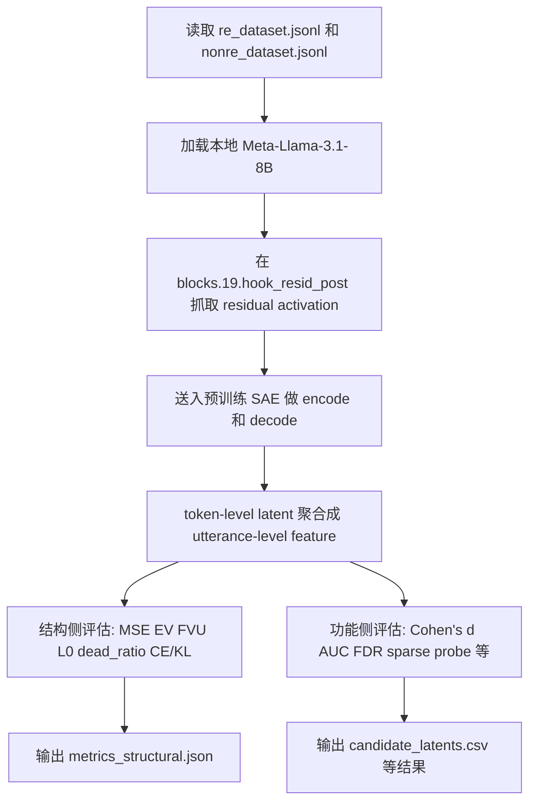

# SAE-RE阶段性汇报

## 一页结论

当前项目已经完成一条可运行的 SAE-RE 评估管线：本地 `Meta-Llama-3.1-8B` 读取 `RE / NonRE` 文本，在第 19 层 residual stream 提取激活，送入预训练 SAE 分解，再从结构指标和功能（可解释性）指标两个侧面评估这些 latent 是否与 RE 概念相关。现阶段最强的可支持结论不是“已经证明某个 latent 就是 RE 概念本身”，而是“该 SAE 中已经存在一组与 RE 特征显著相关的 latent 子集，可继续做后续解释与干预研究”。

当前可以明确支持的结论有 3 点：

1. 该项目的 SAE-RE 运行流程已经打通，能够稳定产出结构指标、候选 latent 排名和多种功能侧证据。
2. 当前已经能确认：该 SAE 空间中存在明显与 RE 特征相关的 latent 子集，而不是完全没有 RE 信号。
3. 结构侧若干指标偏弱，且当前结构统计带有 sample-based 偏置，因此现阶段不能把结构结果直接上升为“SAE 本体质量已被最终判定”，需要重新采样后再做更强结论。

当前不能支持的强结论也需要明确：

- 还不能说已经确认了“单一、典型、因果可信”的 RE monosemantic latent。
- 还不能说当前这份 SAE 在本任务上结构健康、重构保真充分。
- 还不能说已经完成了 RE 概念的强因果验证或稳健泛化验证。

---

## 项目目标与研究对象

这个项目的目标不是重新训练 SAE，而是把一个已经训练好的预训练 SAE 当作“概念显微镜”，去观察本地 `Meta-Llama-3.1-8B` 在第 19 层 residual stream 上，`RE` 与 `NonRE` 文本是否会激活出一批有研究价值的稀疏特征。

换句话说，本项目做的是“概念特征发现与验证”，而不是普通的下游分类建模。输入是 `re_dataset.jsonl` 和 `nonre_dataset.jsonl` 中的正负样本；输出不是单纯的分类器，而是一组候选 latent、对应的统计证据、probe 证据、定性证据以及后续可继续做干预验证的研究对象。

当前研究单位是单条 `unit_text`，不是完整对话级机制。因此现在的结论更接近“某些句级表达风格或内容线索与 RE 对齐”，而不是“已经完整识别出对话层面的 RE 机制”。

---

## SAE-RE 整体运行流程

### 1. 端到端流程概览

### 2. 具体执行步骤

1. 读取 `data/mi_re/re_dataset.jsonl` 与 `data/mi_re/nonre_dataset.jsonl`，提取每条样本的 `unit_text`。
2. 加载本地基础模型 `Meta-Llama-3.1-8B` 和对应 tokenizer。
3. 从 Hugging Face 下载并加载预训练 SAE：`OpenMOSS-Team/Llama3_1-8B-Base-LXR-8x / Llama3_1-8B-Base-L19R-8x`。
4. 将文本按 batch 送入本地 Llama，在 `blocks.19.hook_resid_post` 用 forward hook 抓取第 19 层 residual stream 激活。
5. 将 token-level activation 送入 SAE，得到：
   - 重构激活 `z_hat`
   - 稀疏 latent 激活 `h`
6. 将 token-level latent 按句子聚合为 utterance-level feature，当前默认聚合方式是 `max`。
7. 在结构侧比较原激活与 SAE 重构激活，计算重构保真、稀疏性、死亡率和 CE/KL 等指标。
8. 在功能侧按 latent 逐列比较 RE 与 NonRE 的差异，计算单 latent 统计量，并进一步做 sparse probe、dense baseline、DiffMean、MaxAct、Feature Absorption、Feature Geometry 和 TPP 等评估。
9. 输出关键结果文件，如 `metrics_structural.json`、`candidate_latents.csv` 及后续功能侧汇总结果。

### 3. 当前流程的研究意义

这条流程的核心价值不在“重新训练一个更好的 SAE”，而在“把现成 SAE 接入本地模型和本地 RE 数据之后，检查 SAE 空间里是否存在与 RE 对齐的可解释候选特征”。因此，这套流程当前已经适合做：

- 候选 latent 发现
- RE 相关子空间筛选
- 后续定性审查与因果实验前的证据收集

但它还不等价于：

- 已经完成概念因果确认
- 已经证明 SAE 结构本身足够优
- 已经完成跨数据分布的稳健验证

---

## 关键参数说明

### 1. 运行参数与含义

| 参数 | 当前取值 | 控制什么 | 值变大/变小的一般影响 |
|---|---|---|---|
| `model_name` | `Meta-Llama-3.1-8B` | 当前接入的本地基础模型 | 更换模型会直接改变激活分布，原 SAE 可能不再匹配 |
| `model_path` | `models/Llama-3.1-8B` | 本地模型权重路径 | 路径错误会导致无法加载；换模型目录等于换研究对象 |
| `sae_repo_id` | `OpenMOSS-Team/Llama3_1-8B-Base-LXR-8x` | SAE 所在仓库 | 更换仓库等于更换整套 SAE |
| `sae_subfolder` | `Llama3_1-8B-Base-L19R-8x` | 选择具体 SAE checkpoint | 选错子目录会与层位或底模不匹配 |
| `hook_point` | `blocks.19.hook_resid_post` | 从基础模型哪一层抓激活 | 换层会改变 latent 语义，通常需要连 SAE 一起换 |
| `d_model` | `4096` | 基础激活维度 | 由底模层宽决定，必须与 SAE 输入维度一致 |
| `d_sae` | `32768` | SAE latent 字典大小 | 更大通常潜在表达能力更强，但也更容易出现大量低频或 dead latent |
| `act_fn` | `jumprelu` | SAE 编码激活函数 | 更硬的稀疏门控通常更稀疏，但可能牺牲保真度 |
| `jump_relu_threshold` | `0.52734375` | JumpReLU 激活阈值 | 阈值更高通常更稀疏、死亡率更高；更低则更易激活、可能更稠密 |
| `norm_activation` | `dataset-wise` | 输入激活归一化方式 | 会影响 encode 前的尺度对齐，进而影响激活模式和重构质量 |
| `dataset_average_activation_norm_in` | `17.125` | dataset-wise norm 的目标尺度 | 尺度不对可能让预训练 SAE 在本地数据上适配变差 |
| `aggregation` | `max` | token-level latent 到 utterance-level 的聚合方式 | `max` 更强调局部强激活；`mean` 更平滑但可能稀释罕见强信号 |
| `max_seq_len` | `128` | 文本最大截断长度 | 更大可保留更多上下文，但计算更慢、显存更高 |
| `batch_size` | `4` | 主推理 batch 大小 | 更大更快但更占显存；更小更稳但更慢 |
| `ce_kl_batch_size` | `2` | CE/KL 干预评估 batch 大小 | 更大更快但更容易显存吃紧；更小更安全 |
| `fdr_alpha` | `0.05` | BH-FDR 显著性阈值 | 更小更严格；更大更容易筛出更多显著 latent |
| `probe_k_values` | `[1, 5, 20]` | sparse probe 评估的 top-k latent 数量 | 更大更容易得到高分类分数，但解释性通常更弱 |
| `top_k_candidates` | `50` | 后续功能分析保留的候选 latent 数量 | 更大覆盖更多候选，但后续分析更耗时 |
| `collect_structural_samples` | `5` | 默认保留多少个 batch 的 token-level sample 用于结构评估 | 更大可缓解 sample 偏差，但会增加内存占用 |
| `full_structural` | `False` | 是否启用全量 token 在线结构统计 | 打开后可减少 sample 偏差，但当前实现的在线 `MSE` 仍需谨慎解读 |

说明：

- `batch_size` 在 `run_sae_evaluation.py` 中由命令行参数控制，默认值为 `4`；`sae_config.json` 中也有 `batch_size=8`，但主脚本实际运行以 CLI 参数为准。
- `full_structural` 不是配置文件字段，而是主脚本的命令行开关，默认关闭。

### 2. 结果指标含义

| 指标 | 当前值 | 指标含义 | 一般如何解释 |
|---|---:|---|---|
| `MSE` | `4.5804` | 原激活与 SAE 重构激活的均方误差 | 越低越好，但当前实现口径已知需要谨慎解读 |
| `cosine_similarity` | `0.8088` | 原激活与重构激活的方向相似性 | 越高越好；当前说明方向上仍有一定接近 |
| `explained_variance` | `0.0682` | SAE 重构解释了多少原始方差 | 越高越好；当前仅解释约 6.8%，偏弱 |
| `FVU` | `0.9318` | 未解释方差比例 | 越低越好；当前偏高，说明保真度偏弱 |
| `l0_mean` | `172.6` | 每个 token 平均激活多少个 latent | 越低越稀疏；当前很稀疏，但不能单独代表质量高 |
| `dead_ratio` | `90.05%` | 当前样本中从未激活的 latent 比例 | 当前偏高，但受任务分布和 sample 统计方式强影响 |
| `ce_loss_delta` | `2.3898` | 用 SAE 重构替换后模型 CE loss 的增量 | 越低越好；当前说明替换后行为偏移明显 |
| `kl_divergence` | `3.1969` | SAE 替换前后输出分布的 KL 差异 | 越低越好；当前说明行为层 fidelity 偏弱 |
| `Cohen's d` | top-1 `0.8991` | 单 latent 在 RE 与 NonRE 间的效应量 | 绝对值越大差异越强；正值更偏 RE，负值更偏 NonRE |
| `AUC` | top-1 `0.7003` | 单 latent 单独区分 RE / NonRE 的排序能力 | 离 `0.5` 越远越强；大于 `0.5` 偏 RE，小于 `0.5` 偏 NonRE |
| `p_value` | 每 latent 各自计算 | 两组差异是否可能由随机波动造成 | 越小越显著，但要结合多重比较校正看 |
| `significant_fdr` | `1540 / 32768` 显著 | 经过 BH-FDR 校正后是否仍显著 | 用来控制多重比较下的假阳性 |
| `sparse_probe AUC` | top-k 最强为 `0.9131` | 用少量 top latent 训练 probe 后的区分能力 | 越高越说明少量 latent 子集已携带较强 RE 信息 |
| `dense_probe AUC` | `0.9677` | 直接在原始 dense activation 上训练 baseline probe 的能力 | 越高越说明原表示中 RE 信息很强，也是 SAE 的上界参考 |
| `diffmean AUC` | `0.9007` | 沿 RE / NonRE 差均值方向的一维基线区分能力 | 简单基线已很强，说明数据本身存在明显分隔方向 |

---

## 当前已经确认的结果

### 1. 已经确认存在 RE 相关 latent 子集

从当前结果看，最稳妥、最清楚的结论是：

> 当前这份 SAE 空间中已经存在一组与 RE 特征显著相关的 latent 子集。

这个结论来自一条比较完整的证据链，而不是只靠单个指标。

### 2. 证据链一：单 latent 层面已出现大量显著信号

- 在全部 `32768` 个 latent 中，有 `1540` 个在 BH-FDR 校正后仍显著。
- 这说明 SAE 空间里不是完全没有 RE 相关信号，也不是只有极少数偶然波动的 latent。
- 因此，“SAE 空间中存在 RE 相关候选特征”这一层结论已经成立。

### 3. 证据链二：Top latent 已有较强效应量与区分度

- top-1 latent 的 `Cohen's d = 0.8991`
- top-1 latent 的 `AUC = 0.7003`

这说明至少存在一些单个 latent，在 RE 与 NonRE 之间具有较明显的统计差异和可分性。虽然这还不足以说明“它就是纯净 RE neuron”，但已经足够说明“它不是随机噪声 latent”。

### 4. 证据链三：少量 latent 组合已经能较强区分 RE / NonRE

- `sparse_probe_k20 AUC = 0.9131`

这个结果说明：只用按统计量排序后的少量 top latent，已经可以得到较强的 RE / NonRE 区分能力。也就是说，RE 相关信息已经被一小组 SAE latent 显著携带，而不是只能在原始 dense activation 里才能看到。

### 5. 证据链四：简单方向基线也有效

- `diffmean AUC = 0.9007`

这说明 RE / NonRE 在当前表示空间里本身就存在较明显的方向性差异，因此 SAE latent 的功能信号不是凭空构造出来的，而是建立在真实表示差异之上。

### 6. 证据链五：dense baseline 更高，说明 RE 信息很强但 SAE 只提取出其中一部分

- `dense_probe AUC = 0.9677`

这个结果有两层意义：

1. 基础模型第 19 层原始表示里确实有很强的 RE 相关信息。
2. SAE latent 已经提取出了其中一部分，而且提取得不差，但还没有完整追平 dense 表示。

因此，当前更合理的说法是：

- 已经确认存在 RE 相关 latent 子集。
- 还不能说“已经找到了单一、强效、纯净、因果可信的 RE 概念表示单元”。

### 7. 相关补充结果

- `avg_re_purity = 0.576` 说明高激活样本中确有 RE 倾向，但还不够纯。
- `overall_mean_absorption = 0.5464` 说明候选 latent 之间仍存在一定冗余。
- `feature_geometry max_cosine = 0.5519` 说明局部几何上仍有部分 latent 高度相似。
- `TPP max accuracy_drop = 0.040` 说明个别 latent 对 probe 决策有一定贡献，但目前仍主要是 probe-space 层面的重要性分析，不是模型层因果干预证明。

---

## 结构侧问题与为何需要重新采样

### 1. 结构侧当前确实偏弱

当前结构侧几个关键值如下：

- `explained_variance = 0.0682`
- `FVU = 0.9318`
- `dead_ratio = 90.05%`
- `ce_loss_delta = 2.3898`
- `kl_divergence = 3.1969`

这些结果合起来说明：

- SAE 在当前任务上的重构保真度偏弱；
- 大量 latent 在当前样本中没有被激活；
- 把 SAE 重构激活替换回模型后，模型行为和输出分布发生了明显偏移。

因此，从结构侧看，当前 SAE 更像是“一个还能做候选特征发现的分解器”，而不是“一个已经在本任务上达到高 fidelity 的结构优秀 SAE”。

### 2. 但当前结构统计方法本身也存在明显口径问题

当前结构指标默认不是全量 token 统计，而是 sample-based 统计。具体来说：

- 主流程默认只保留前 `collect_structural_samples = 5` 个 batch 的 token-level sample 来算结构指标。
- 数据顺序是 `RE` 样本在前、`NonRE` 样本在后。
- 因此默认结构评估很可能更偏向前缀 RE 文本，而不是对全体 `RE + NonRE` token 做均衡统计。

这会带来两个后果：

1. `dead_ratio`、`explained_variance`、`FVU` 等值更像“局部样本估计”，不能直接当成 SAE 全局健康度结论。
2. 如果前缀文本分布刚好更窄、句子更短或更单一，那么死亡率和重构指标都可能被进一步放大。

### 3. 如何理解当前 `dead_ratio = 90.05%`

当前这个值不能简单理解为“这个 SAE 本体 90% 都坏了”，因为它同时受三类因素影响：

- 预训练 SAE 与本地下游数据集分布差异很大；
- 当前任务是很窄的 RE / NonRE 句级任务；
- 当前结构统计只基于前 `5` 个 batch 的 sample。

因此，这个值更合理的解释是：

- 它提示“当前任务分布下的有效 latent 利用率偏低”；
- 但它还不能单独作为“SAE 本体结构不合理”的最终结论；
- 需要在更公平的抽样或全量统计下重新评估。

### 4. 当前最稳妥的结构侧结论

当前结构侧最稳妥的结论应表述为：

> 当前结构指标提示该 SAE 在本任务上的 fidelity 偏弱，但现有结构统计仍带有明显 sample-based 偏置，因此需要重采样或重估后，才能对 SAE 本体结构质量下更强判断。

---

## 下一步建议

### 1. 重做结构评估采样口径

把默认结构评估从“固定前 5 个 batch”改成更可靠的方式，例如：

- 随机抽样
- 分层抽样
- 或直接做全量 token 在线统计

这样才能让 `dead_ratio`、`EV/FVU` 等指标更接近真实任务分布下的结构表现。

### 2. 分开报告 `RE-only / NonRE-only / mixed` 三组结构指标

建议下一轮结构评估至少分别报告：

- `RE-only`
- `NonRE-only`
- `mixed`

这样可以看清：

- 高死亡率到底是任务分布现象，还是 SAE 普遍利用率低；
- 某些结构指标是否对 RE 和 NonRE 文本不对称。

### 3. 在功能侧继续增加更强的因果验证

当前已经足够支持“候选 RE latent 子集存在”，下一步应把重点推进到：

- 模型空间中的 activation intervention
- 更直接的 ablation / steering
- 更严格的 held-out 验证

这样才能把现有“统计相关 + probe 相关”的证据，推进到更强的“因果贡献”证据。

---

## 汇报口径建议

如果用于组会或导师汇报，建议把当前项目定位成：

> 我们已经把一条预训练 SAE 接入本地 Llama 与本地 RE 数据的分析管线跑通，并且已经确认 SAE 空间中存在一组与 RE 特征显著相关的 latent；但结构侧当前仍偏弱，且统计方法存在 sample-based 偏置，因此下一阶段重点不是夸大已有结论，而是重做结构评估并推进更强的因果验证。

这句话基本能准确概括当前阶段的位置：流程已打通，候选特征已发现，强结论还不能提前下。
