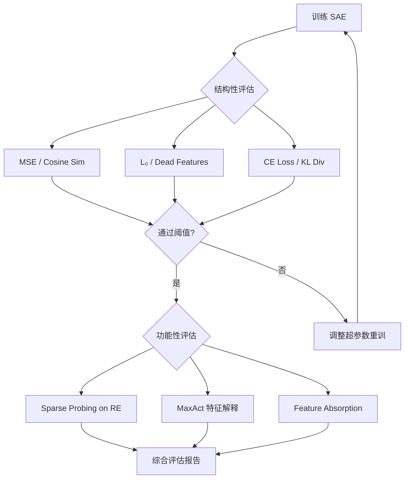

# SAE 性能评估指标参考文档

> **来源**: *A Survey on Sparse Autoencoders: Interpreting the Internal Mechanisms of Large Language Models* (arXiv 2503.05613v3, EMNLP 2025 Findings)  
> **用途**: 作为本项目 SAE 可解释性工作的性能评估框架参考

---

## 一、评估总框架

SAE 没有 ground truth label，质量只能通过一组代理指标推断。评估分两类：

| 类别 | 核心问题 | 关注维度 |
|------|----------|----------|
| **结构性指标 (Structural)** | SAE 有没有按设计目标工作？ | 重构保真度、稀疏性 |
| **功能性指标 (Functional)** | SAE 学到的特征是否真正有用？ | 可解释性、鲁棒性 |

> [!IMPORTANT]
> "重构误差低" ≠ "可解释性强"。必须将**训练目标达成情况**与**解释性实际效用**分开评估。

---

## 二、结构性指标 (Structural Metrics)

### 2.1 重构保真度 (Reconstruction Fidelity)

核心问题：SAE 把原始激活压成稀疏特征后再解码，恢复得有多像原始激活？

| 指标 | 公式/定义 | 说明 | 优先级 |
|------|-----------|------|--------|
| **MSE** | `‖z - ẑ‖₂²` | 原始激活与 SAE 重构激活的均方误差 | ⭐⭐⭐ |
| **Cosine Similarity** | `cos(z, ẑ)` | 重构前后激活方向一致性 | ⭐⭐⭐ |
| **FVU** | `1 - Var(ẑ)/Var(z)` | Fraction of Variance Unexplained，未重构到的方差比例 | ⭐⭐ |
| **Explained Variance** | `Var(ẑ)/Var(z)` | 重构后保留的原始方差占比 | ⭐⭐ |
| **Cross-Entropy Loss** | `CE(p_orig, p_sae)` | 替换激活后模型输出分布变化 | ⭐⭐⭐ |
| **KL Divergence** | `KL(p_orig ‖ p_sae)` | 替换前后输出概率分布偏移 | ⭐⭐⭐ |
| **Delta LM Loss** | `Loss_sae - Loss_orig` | 原语言模型 loss 与 SAE 替换后 loss 的差异 | ⭐⭐ |
| **L₂ Ratio** | `‖ẑ‖₂ / ‖z‖₂` | 检查 SAE 是否系统性改变激活幅值 | ⭐ |

> [!TIP]
> 评估不应仅停留在隐藏状态空间，还要看"用 SAE 重构后的激活，模型最终输出分布有没有被扭曲"——即 **CE Loss** 和 **KL Divergence**。

### 2.2 稀疏性 (Sparsity)

核心问题：有多少 latent 被激活？这些 latent 是否被合理使用？

| 指标 | 定义 | 说明 | 优先级 |
|------|------|------|--------|
| **L₀ Sparsity** | 每个输入平均非零 latent 数 | 最直接的稀疏度量 | ⭐⭐⭐ |
| **Latent Firing Frequency** | 每个 latent 在数据上被触发的频率 | 防止 latent 过于频繁或长期"死亡" | ⭐⭐ |
| **Feature Density Statistics** | 特征使用密度分布 | 发现 dead features 和过度活跃特征 | ⭐⭐ |
| **Sparsity-Fidelity Trade-off** | 不同稀疏度下的重构质量曲线 | 寻找稀疏性与保真度的最优平衡点 | ⭐⭐⭐ |

> [!WARNING]
> 太稀疏 → 丢信息；太稠密 → 降低可解释性。不是"越稀疏越好"，要在不同 sparsity 下权衡重构和解释性。

---

## 三、功能性指标 (Functional Metrics)

### 3.1 可解释性 (Interpretability)

终极目标：SAE latent 是否形成**有意义、可区分、单义 (monosemantic)** 的特征。

#### 3.1.1 单义性 / 特征描述质量

| 方法 | 机制 | 说明 |
|------|------|------|
| **RAVEL** | LLM 自动生成+评估特征描述 | 分析高激活上下文，给出解释性分数 |
| **Automated Interpretability** | LLM 自动生成+评估特征描述 | 检验 latent 能否被总结为清晰、稳定的概念 |

#### 3.1.2 任务对齐能力

| 方法 | 机制 | 说明 |
|------|------|------|
| **Sparse Probing** | 用少量 SAE latent 训练线性 probe | 若 probe 有强性能 → SAE 学到了稀疏而有信息量的特征 |
| **TPP** (Targeted Probe Perturbation) | 扰动单个 latent，观察 probe 精度变化 | 因果验证：该 latent 是否真正驱动任务 |

> [!NOTE]
> Sparse Probing 是相关性检验，TPP 是因果性检验。两者结合才能确认特征的任务对齐性。

#### 3.1.3 特征描述忠实度 (Faithfulness)

| 方法 | 机制 | 评估要点 |
|------|------|----------|
| **Input-Based Evaluation** | 生成会/不会激活该特征的样本，比较激活差异 | 描述是否识别了正确的激活模式 |
| **Output-Based Evaluation** | 调节特征激活，观察生成文本变化 | 描述是否捕捉了特征对输出的因果影响 |

> [!IMPORTANT]
> 区分"看起来能解释"与"解释得对"。**Output-Based Evaluation** 是更强的忠实度验证。

#### 3.1.4 概念吸收与冗余

| 方法 | 机制 | 说明 |
|------|------|------|
| **Feature Absorption** | 检测正确 latent 未激活而语义相近 latent 被激活的比例 | Mean absorption / Full absorption |
| **Feature Geometry Analysis** | 比较 decoder 列向量间余弦相似度 | 高相似度 → 冗余编码而非独立概念 |

### 3.2 鲁棒性 (Robustness)

好的 SAE 在不同条件下应保持稳定。

| 指标 | 定义 | 说明 |
|------|------|------|
| **Generalizability** | OOD 泛化能力 | 短序列→长序列、base→instruction-finetuned |
| **Unlearning** | 选择性遗忘某类特征并保留其他有用信息 | 隐私场景关键评估 |
| **SCR** (Spurious Correlation Removal) | 移除偏差 latent 后去偏效果 | 适量 ablation 可去偏，但过度会误删有用信息 |

---

## 四、实验对比框架 (Appendix D 实践参考)

综述在附录 D 中对三类 SAE 做了实际对比：**LLaMa Scope**、**Pythia SAE**、**Gemma Scope**。

### 4.1 实验报告的指标组合

| 类别 | 实际使用指标 |
|------|------------|
| **结构性** | L₀ Sparsity, MSE, CE Loss, KL Divergence, Explained Variance |
| **功能性** | Absorption (Mean/Full), SCR (Top-5/50/500), Sparse Probing (vs LLM baseline) |

### 4.2 关键实验结论

| 发现 | 描述 |
|------|------|
| **更稠密 → 重构更好** | 随 SAE 密度增大，MSE↓，CE/KL→1，Explained Variance↑ |
| **更稠密 ≠ 更可解释** | 过稠密时 absorption 可能升高，概念重新被压回同一 latent |
| **存在最优稀疏度** | 如 Gemma Scope L0:176 在 absorption 上表现最优 |
| **SCR 非单调** | 适量删 latent 可去偏，过度 ablation 误删有用信息 |
| **SAE 有时超过 probe** | 特定设置下 SAE probe ≈ 甚至 > LLM baseline probe |

---

## 五、评估局限性与注意事项

| 局限 | 影响 |
|------|------|
| **缺少输出中心指标** | 现有指标仍不足以衡量重构激活如何影响生成文本 |
| **重构误差可能很严重** | 可导致性能退化至仅 10% 预训练算力的水平 |
| **SAE 未必优于简单 probe** | AXBENCH 显示简单线性 probe 在概念检测/steering 上可稳定超过 SAE |
| **跨模型不可迁移** | 必须为每个模型每层单独训练，计算代价极高 |

> [!CAUTION]
> SAE 不是"默认最优方案"。在数据稀缺、类别不平衡、噪声标签、协变量偏移等困难场景下，SAE 并没有相对于简单 probing 方法的稳定优势。

---

## 六、本项目推荐评估方案

基于综述框架，建议本项目分**核心指标**和**扩展指标**两级：

### 6.1 核心指标（必须实现）

```
结构性:
  - MSE (reconstruction error)
  - Cosine Similarity (direction preservation)
  - L₀ Sparsity (active feature count)
  - CE Loss / KL Divergence (downstream distribution shift)
  - Dead Feature Ratio (latent firing frequency)

功能性:
  - Sparse Probing (RE concept alignment)
  - MaxAct Analysis (qualitative feature interpretation)
```

### 6.2 扩展指标（按需实现）

```
结构性:
  - FVU / Explained Variance
  - L₂ Ratio
  - Sparsity-Fidelity Trade-off Curve

功能性:
  - Feature Absorption (Mean/Full)
  - Feature Geometry Analysis (decoder column cosine similarity)
  - Output-Based Evaluation (causal faithfulness)
  - SCR (debiasing capability)
  - Generalizability (cross-distribution)
```

### 6.3 评估流程建议


