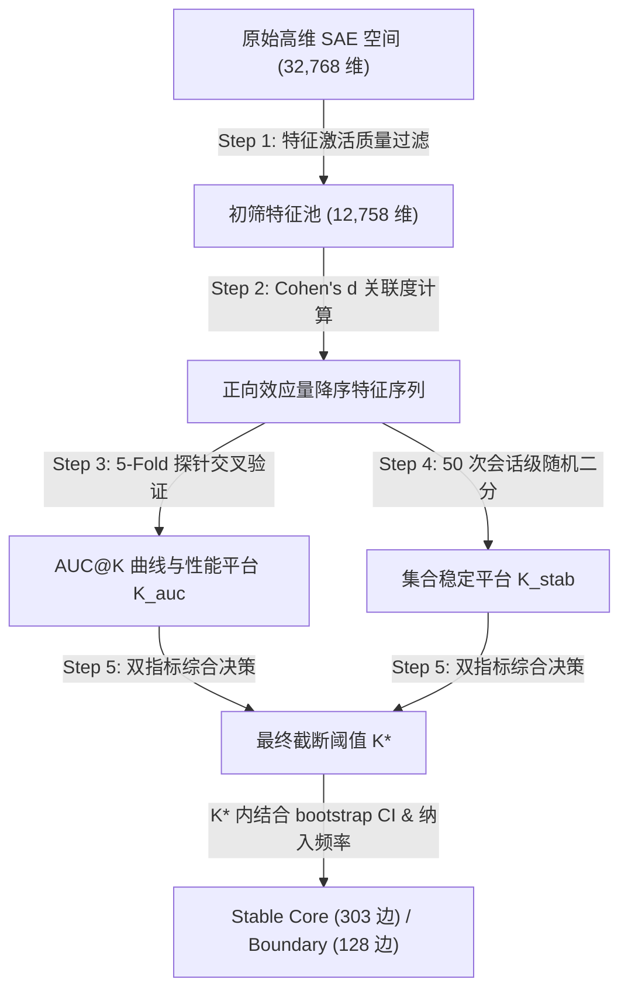

# SAE 隐性特征稳定筛选与 $K$ 值确定技术说明书（学术汇报版）

**文档类型**：研究方法论与实验技术说明  
**面向对象**：导师及学术同行  
**生成日期**：2026-07-07  
**核心进展**：本文档基于最近几次代码提交（Commits），阐明本研究如何利用交叉验证与重采样技术，从高维稀疏特征空间中筛选出与咨询行为标签稳定相关的隐性表征集合 `stable_core`（稳定核心特征集），并确定每个行为标签的候选特征截止规模 $K^*$。

---

## 1. 研究背景与设计动机

在基于稀疏自编码器（Sparse Autoencoder, SAE）的心理咨询行为（MISC 2.1 编码系统）可解释性研究中，语言模型隐藏状态被解耦为高达 32,768 维的 **SAE latent**（稀疏自编码器隐性特征维度，语言模型激活值在解耦稀疏空间中的局部特征表示）。

直接在全维特征空间中对咨询行为标签进行可解释性分析，面临两大严峻挑战：
1. **假阳性统计干扰**：极高维的空间中存在大量稀疏激活或与样本高度偶合的特征，容易混入统计噪音。
2. **多特征共线性与可替代性**：多个特征可能表达相似的局部语义（如不同的问句模板特征），导致在不同数据划分下，被筛选出的特征集合波动剧烈，缺乏统计稳定性。

本研究最新演进的核心方法，通过建立一套双阶段统计审计框架，确定每个 MISC 标签的最佳特征截断点 $K^*$（每个标签纳入候选特征集合的截断阈值），并最终精筛出 `stable_core`（稳定核心特征集，在前 $K^*$ 个特征中具有高频复现性与置信区间支持的特征边），作为下游解释卡片构建和人工语义审查的输入。

---

## 2. 核心指标与学术名词术语速查表

为保证研究表述的严谨性，以下对文中涉及的专业名词及统计指标给出规范学术释义：

* **SAE latent**（稀疏自编码器隐性特征维度，用于解耦语言模型高维隐藏状态、具有高稀疏性与局部语义选择性的激活维度）
* **counselor utterance**（咨询师话语，本研究中作为样本输入的基本语篇分析单元，即 counselor 的一轮言语表达）
* **MISC label**（心理咨询行为标签，心理咨询行为编码系统 MISC 2.1 下定义的咨询师具体言语行为分类，如提问、反映等）
* **Cohen's d**（标准化均值差，用于度量两组样本均值差异的统计效应量大小。在本研究中，用于计算某特征在行为标签阳性样本与阴性样本之间激活均值的标准化差异）
* **linear probe**（线性分类探针，在特征空间上训练的简单二分类线性分类器，通过其预测性能来评估特征子空间所蕴含的目标标签信息量）
* **AUC**（受试者工作特征曲线下面积，用于评估分类模型整体排序与辨别性能的指标，0.5 接近随机，1.0 为完美分类）
* **AUC@K**（前 $K$ 个特征子空间的分类表现，即仅使用某个标签下 Cohen's d 排序前 $K$ 个特征构建线性探针时所达到的交叉验证 AUC 值）
* **stratified-group-kfold**（分层分组交叉验证，一种严谨的交叉验证划分方法。在此按照咨询会话文件 ID 分组以防同会话数据泄漏，同时按行为标签的阳性比例分层以确保各折数据分布一致）
* **standard error (SE)**（标准误，此处指交叉验证中各折 AUC 估算值样本均值的标准偏差，反映 AUC 估计值的不确定性，计算公式为 $SE = \frac{SD_{auc}}{\sqrt{n_{folds}}}$）
* **repeated split-half**（重复二分样本法，以会话文件为单位将数据集随机分成两等分，用以检验结果可重复性的统计验证方法）
* **TopK Jaccard**（前 K 个特征集合的交并比，用于衡量在两个独立子集上独立筛选出的前 $K$ 个特征的集合重叠相似度，计算公式为 $\text{Jaccard}(A, B) = \frac{|A \cap B|}{|A \cup B|}$）
* **observed_jaccard_p05**（交并比的第 5 百分位数，即在多次重复二分中，95% 的情况下交并比所能达到的保守下限值，是评估特征集合稳定性的高标准指标）
* **passes_null_2sd_rate**（超过随机基线显著率，表示真实特征集合重叠度显著优于随机抽取特征集合时 Null 均值加上 2 倍标准差的实验重复比例）
* **bootstrap CI**（自举法置信区间，基于 1000 次重采样的非参数估计区间，用于验证 Cohen's d 效应量是否在统计上显著偏离零）
* **inclusion frequency**（重复二分纳入频率，特征在多次随机拆分数据下进入 Top-K 候选集的概率）
* **cross-quality AUC drop**（跨会话质量数据源的性能下降，用于评估模型在高质量和低质量会话数据之间的泛化损失，用作风险审计指标）
* **prevalence**（标签基率，即某个心理咨询行为标签在全部样本中的阳性比例）
* **precision@50**（前 50 激活样本精确率，指该特征激活最强的 50 个样本中，实际属于目标行为标签的比例）
* **precision lift**（精确率提升，即 precision@50 减去该标签在全体数据集中的基率，用以度量特征激活对目标行为的特异性指示强度）
* **FDR**（错误发现率校正，在大规模多重假设检验中控制假阳性发现比例的统计校正方法）

---

## 3. 隐性特征稳定筛选的五步法流程

本研究的稳定筛选及 $K^*$ 确定流程可划分为以下五个核心步骤，其关系如下图所示：

### 3.1 第一步：特征激活质量过滤（构建初筛特征池）
原始 SAE 产生了 32,768 个特征，但多数特征不适合进行语义解释。我们通过 `FeatureFilterConfig`（特征激活质量过滤配置）排除以下三类低质量特征：
1. **罕见激活特征**（`rarely_active`）：激活样本数过少，无法支持稳定的统计推断（共删除 19,958 个）。
2. **零或近零方差特征**（`zero_or_near_zero_variance`）：在样本中激活值几乎恒定（如死特征，共删除 10,606 个，与罕见激活有部分重叠）。
3. **常态激活特征**（`almost_always_active`）：在几乎所有文本中都处于激活状态，丧失了对具体行为标签的选择特异性（共删除 52 个）。

* **过滤结果**：保留了 12,758 个有效特征，构成 **初筛特征池**（filtered latent pool），极大地压缩了参数搜索空间，降低了多重比较时的假阳性风险。

### 3.2 第二步：统计效应量排序
在初筛特征池中，针对 9 个核心 MISC 标签，分别计算每个特征在样本激活均值之间的 **Cohen's d**。我们仅保留具有正向效应（即特征在阳性样本中的激活程度高于阴性样本）的特征，并将特征按 Cohen's d 降序排列，形成备选特征序列。

### 3.3 第三步：基于预测性能确定平台截断点 $K_{auc}$
我们通过评估特征子空间的分类贡献，寻找性能接近饱和平台时的最小特征数量 $K_{auc}$：
1. 对于每个标签，依次取 Cohen's d 排序前 $K$ 个特征组成子空间（$K \in [0, 100]$）。
2. 使用这前 $K$ 个特征作为分类特征，训练线性探针，并采用五折分层分组交叉验证评估测试集的平均 AUC 值（记为 $AUC@K$）。
3. 找出 $K \le 100$ 内的最高平均 AUC 值（$best\_auc$）和对应特征数（$best\_k$），并计算其标准误 $best\_auc\_se$。
4. 设定目标平台性能阈值：
   $$target\_auc = best\_auc - \max(0.01, best\_auc\_se)$$
5. 在所有满足 $AUC@K \ge target\_auc$ 的特征规模中，选择**最小的 $K$** 作为性能平台截断点 $K_{auc}$。

> [!NOTE]
> 该设计旨在寻找“用最精简的特征维度重现绝大部分分类信息”的折中点，避免为了追求统计噪音中的微弱增益（如 $0.001$ 级的 AUC 提升）而引入过多冗余特征。

### 3.4 第四步：基于重采样确定集合稳定截断点 $K_{stab}$
为确保筛选出的 Top-K 特征集合在不同数据子集上具有可复现性，我们使用重复二分样本法进行稳定性审计：
1. 以咨询会话文件为单位，将数据集随机划分为两等份（Split A 与 Split B），重复该划分 50 次。
2. 每次随机划分中，在 A、B 两边独立计算特征的 Cohen's d 并重新排序，得到两边的 Top-K 特征集合。
3. 计算两边 Top-K 集合的交并比（TopK Jaccard）。
4. 在 $K \ge K_{auc}$ 且 $K \le 100$ 的范围内，寻找同时满足以下稳定性阈值的最小 $K$ 作为 $K_{stab}$：
   * **保守稳定性要求**：50 次划分的 Jaccard 交并比第 5 百分位数 $observed\_jaccard\_p05 \ge 0.40$（即在 95% 的划分情况下，两半数据筛选出的特征重合度不低于 40%）。
   * **显著性要求**：交并比显著高于随机基线，即超随机显著率 $passes\_null\_2sd\_rate \ge 0.95$。
5. 若在此区间内没有 $K$ 满足上述两个条件，则说明该标签的特征整体替换性过强，集合稳定性不足，$K_{stab}$ 留空。

### 3.5 第五步：综合决策最终截断点 $K^*$ 并精筛 `stable_core`
基于性能与稳定性的双重考量，确定每个标签的最终候选截止规模 $K^*$：
$$\text{若存在 } K_{stab}\text{，则 } K^* = K_{stab}\text{；否则 } K^* = K_{auc}$$
在确定 $K^*$ 截断后，在 full-data 前 $K^*$ 个特征内，结合自举法和二分出现频率进行特征级别的双重过滤，划分出不同的特征角色：
* **`stable_core`（稳定核心特征）**：特征在 full-data 排名不大于 $K^*$，在二分重采样中被纳入 Top-$K^*$ 的频率 $inclusion\_frequency \ge 0.70$，且其 Cohen's d 自举法置信区间下界 $cohens\_d\_ci\_lo > 0$（保证正向统计效应稳健成立）。
* **`boundary_candidate`（边界候选特征）**：特征在 full-data 排名不大于 $K^*$，且其 Cohen's d 置信区间下界大于 0，但二分重采样纳入频率介于 $[0.40, 0.70)$ 之间。
* **`unstable_inclusion`（不稳定特征）**：纳入频率低于 $0.40$ 的特征。
* **`ci_not_supported`（效应方向不稳特征）**：置信区间下界小于等于 0 的特征。

---

## 4. 为什么不采用旧的 Minimal Sufficient Subspace 预测充分性指标？

在早期实验中，我们曾使用过 **minimal sufficient subspace**（最小预测充分子空间，用于探索用最少特征组合还原模型绝大部分分类性能的方法）。

这两种指标的定位和性质截然不同，我们在本研究中**明确采用 `stable_core` 作为可解释性分析和特征卡片的主口径**，原因如下：

| 评估维度 | 旧口径：Minimal Sufficient Subspace | 新口径：Stable Core ($K^*$) |
|---|---|---|
| **研究问题** | 最少需要多少特征组合起来，能接近完整候选池探针的分类性能？ | 每个行为标签下，有哪些统计学上高度稳定、可重复的特征？ |
| **特征行为** | **特征间联合优化**。极度依赖多特征之间的线性互补，特征的替换性极强。 | **单特征统计稳健性**。强调特征在不同数据划分下的独立可重复性与效应量显著性。 |
| **数据稳定性** | **极低**。数据划分微弱改变，优化出的特征组合会剧烈改变。 | **极高**。通过 split-half 稳定过滤，保留了不随样本扰动而发生漂移的统计核心。 |
| **可解释性用途** | 用于证明咨询行为标签是否具有分布式子空间结构。 | **直接作为 P3 解释流水线的输入**，用于生成单维度特征语义解释卡片。 |

---

## 5. 最近几次 Commit 构成的技术证据链

本技术文档对应的 **stable-core 选择部分** 已在最近几次代码提交中闭环。下游 P3 自动解释尚未形成可信闭环：2026-07-10 审计发现旧运行存在规则输出替代 LLM、Scorer 标签泄漏、sample ID 错配和 minimal-pair 缺失等问题，相关无效结果已删除。P3 后续实施只遵循 `doc/P3_stable_core对比式latent解释_Claude_Code执行工作流.md`。

1. **`00aafbc`（引入交叉验证与稳定筛选框架）**：
   实现了 `run_cross_val_stable_topk_selection.py` 与底层算法模块，奠定了 AUC@K 平台探测与随机二分稳定性计算的代码基础。
2. **`821cae0`（落盘交叉验证与 K 选择结果）**：
   在服务器上跑通全量数据，并将每个行为标签的 K 选择表（`stable_k_by_label.csv`）、稳定特征明细表（`stable_topk_latent_set.csv`）和去重总特征表（`stable_topk_global_union.csv`）等核心产物持久化存储至 `outputs/cross_val/stable_topk_selection/`。
3. **`27d1988` 与 `9b8e576`（准备下游 stable-core 接口）**：
   将 downstream P3 的候选输入从早期固定的 `Top20 Cohen's d` 切换为 `stable_core`。这只证明 303 条稳定 label-latent 关系可作为 P3 输入，不代表自动解释、Scorer、minimal pair 或子概念聚合已经通过质量验收。

---

## 6. 最新实验结果数据与解读

以下为基于最新的 `outputs/cross_val/stable_topk_selection/stable_k_by_label.csv` 整理的 9 个 MISC 行为标签的选择结果：

| 行为标签 | 性能平台 $K_{auc}$ | 稳定平台 $K_{stab}$ | 最终截断 $K^*$ | 标签筛选状态 (Status) | 截断性能 (AUC@$K^*$) | 稳定核心数 (stable core) | 边界候选数 (boundary) |
|---|---:|---:|---:|---|---:|---:|---:|
| **RE**（反映） | 66 | 66 | 66 | `stable_topk_found` | 0.849 | 54 | 12 |
| **RES**（简单反映）| 45 | - | 45 | `performance_only_unstable` | 0.784 | 15 | 16 |
| **REC**（复杂反映）| 56 | 56 | 56 | `stable_topk_found` | 0.902 | 47 | 9 |
| **QU**（提问） | 28 | 28 | 28 | `stable_topk_found` | 0.966 | 26 | 2 |
| **QUO**（开放式提问）| 36 | 36 | 36 | `stable_topk_found` | 0.951 | 32 | 4 |
| **QUC**（封闭式提问）| 26 | 59 | 59 | `stable_topk_found` | 0.920 | 45 | 14 |
| **GI**（给予信息） | 72 | - | 72 | `performance_only_unstable` | 0.756 | 26 | 37 |
| **SU**（支持） | 60 | - | 60 | `performance_only_unstable` | 0.852 | 31 | 28 |
| **AF**（主动肯定） | 33 | 33 | 33 | `stable_topk_found` | 0.916 | 27 | 6 |

### 核心结论解读：
1. **高稳定性行为标签**：
   * **提问相关标签**（`QU`、`QUO`）展现出极小的特征截断规模（$K^* \le 36$）和高稳定性。这表明在语言模型内部，提问行为的表征结构紧凑，特征的选择特异性极强。
   * **复杂反映**（`REC`）与**主动肯定**（`AF`）同样表现出良好的稳定性，分别在大约 56 和 33 个特征下完成了平台性能与集合稳定性审计。
   * **封闭式提问**（`QUC`）虽然预测性能在 26 个特征时就已经进入平台（$K_{auc}=26$），但由于特征共线性，其特征集合稳定性直到扩大到 59 个特征时（$K_{stab}=59$）才达标。
2. **集合稳定性不达标标签（`RES`、`GI`、`SU`）**：
   * 这些标签的稳定平台 $K_{stab}$ 留空，表现为 `performance_only_unstable`。
   * **学术解释**：这并不意味着这些标签在模型中没有可用表征，而是表明这些行为在语义表征上高度分散（distributed），或可替代特征非常多。数据划分的随机扰动会改变特征的相对 Cohen's d 排名。
   * **特征成员情况**：尽管这些标签整体特征集合不稳定，但并不排斥其中存在部分极度突出的特征。例如 `SU` 虽然整体不稳，但仍在 $K^*=60$ 空间内筛出了 31 个满足“高频复现 ($inclusion\_frequency \ge 0.70$) + CI 支持”的个体稳定核心（`stable_core`）。
3. **特征边与去重特征规模**：
   * 全量 9 个标签在各自 $K^*$ 空间内，共产生 431 条有效的 label-latent 候选边，其中包含 **303 条稳定核心边**（`stable_core`）和 **128 条边界候选边**（`boundary_candidate`）。
   * 去重后，整个研究涉及的物理特征维度为 **225 个唯一 `stable_core` 特征**，以及 110 个边界特征。这表明部分特征在不同标签之间存在共享（如反映父类 `RE` 与其子类 `REC` 共享了多个稳定核心特征），这为后续进行特征重叠度与标签层级一致性研究提供了精密的量化数据。

---

## 7. 学术表述边界与局限性声明

在向同行及学术委员会汇报时，为体现研究的严谨性，建议在论文中采用以下规范表述：

1. **非因果关系声明**：
   本筛选方法所识别的 `stable_core` 特征，属于**统计关联（statistical association）与预测充分性（predictive sufficiency）证据**，并非因果关系证明。不能仅凭 Cohen's d 和预测 AUC 声称单个特征“等价于”某心理咨询语义概念，仍需结合下游的激活文本审查、对照实验与介入阻断分析。
2. **反映子类（`RES` / `REC`）的语境局限**：
   由于当前模型的输入样本是 counselor 的单轮话语（counselor utterance），不包含前一轮患者的话语（client utterance）。在心理咨询中，简单反映（`RES`）和复杂反映（`REC`）在语义上必须结合患者的话语背景才能准确界定。因此在解释这部分特征时，应明确指出“缺乏上下文关联”的局限性，并将当前特征定义为“具有输入特异性的潜在反映倾向维度”。
3. **稳定性不达标标签的讨论**：
   在汇报 `RES`、`GI` 和 `SU` 的结果时，不应将其特征卡片简单视为无效，而应阐明其“高集合替换度”的统计事实。指出这三个标签在表征上比提问类（`QUO`）更具分布式特征，并建议在下游人工审核时，对此类标签的特征语义泛化性保持更高的审慎态度。
