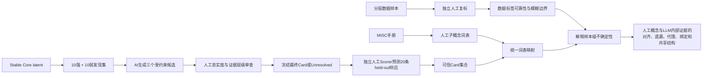

# 人工标签—LLM 概念对齐与 Latent 解释可信度方案

> Status: Proposal for advisor review / 待导师审查方案
>
> 本文用于说明研究问题、人工参与方式和解释可信度设计，不是实验执行规范。当前模型、数据、Stable Core、Explainer–Scorer 输入和正式结果口径，以 [`docs/current/experiment_workflow.md`](../docs/current/experiment_workflow.md) 为唯一事实来源。本文提出的人工词表、人工复标、人工 Card 审查和人工 Scorer 尚未执行；导师确认后，具体执行规则应统一写回该单一事实来源。

## 一、汇报摘要

本研究不把 MISC 数据集标签当作绝对 Gold Standard，也不把能够预测人工标签直接解释为 LLM 已经以人类相同的方式理解了心理咨询行为。我们真正研究的是两种可能的不对齐：第一，LLM 内部表征与人工 MISC 标签边界是否一致；第二，即使两者能够得出相同标签，LLM 使用的内部证据是否仍不同于 MISC 手册所定义的行为概念。

人工部分通过两个环节进入研究。首先，从 MISC 手册中整理出一套由人工确认的“行为子概念词表”，作为规范性的人类概念参照；然后把经过可信度验证的 latent Card 映射到同一词表，比较人工概念体系与模型内部证据的覆盖、遗漏、混合、表面代理和跨标签共享。考虑到原始数据集并非 Gold Standard，还应在一个分层样本上由 MISC 训练过的编码者独立复标，估计数据标签本身的可靠性和模糊边界。

latent 解释的可信度不依靠 AI 自己宣布解释正确。AI Explainer只负责从10条强响应句和10条弱正响应句中提出受约束的候选解释；人工审查者检查候选是否忠实概括发现集，以及是否把表面共现过度解释为心理功能；解释冻结后，由另一组不知道真实响应的人类 Scorer 根据解释预测20条 held-out 句子的相对响应强度。预测与真实 latent 响应的一致性构成解释忠实度证据。

## 二、研究对象与核心问题

当前实验已经从 Llama-3.1-8B 第19层的 SAE 表示中筛选出与7个 MISC 叶标签稳定相关的 latent 集合。稳定关联说明这些 latent 与标签存在可重复的统计关系，但不自动说明 latent 的语义等于标签，也不说明模型使用了与人工编码者相同的概念边界。

因此需要区分三个层面的不对齐。

| 层面 | 比较对象 | 需要回答的问题 |
|---|---|---|
| 样本标签不对齐 | 数据集标签与独立人工复标 | 原始标签有多少一致性、重叠和边界模糊？ |
| 概念体系不对齐 | MISC 手册子概念与 latent Card 子概念 | 模型内部出现、缺失或混合了哪些人工定义的行为概念？ |
| 证据方式不对齐 | 人工功能定义与 latent 的表面/功能证据 | 模型是依赖行为功能、语言形式，还是形式—功能绑定来识别标签？ |

本研究最重要的区别是“得出同一标签”与“以同一方式理解标签”并不等价。一个 QUO latent 可能响应开放式探索功能，也可能只响应 `what/how` 疑问形式，还可能响应二者绑定的固定表达。三种情况都可能帮助标签预测，但对应完全不同的概念理解方式。

## 三、第一部分：建立人类概念参照并比较人机不对齐

### 3.1 为什么不能直接把数据集标签当作答案

MISC 标签是行为编码体系下的人工操作性分类。相邻类别本身可能存在重叠，例如开放式与封闭式提问的边界、简单与复杂反映的边界，都可能受上下文和编码判断影响。当前数据还缺少部分前序来访者话语，因此某些依赖上下文关系的功能判断存在天然限制。

因此，数据集标签只能作为观察到的人工标注，不能被写成唯一正确的心理学真值。如果直接用这些标签判断模型“理解正确或错误”，容易把数据噪声、人工分歧和模型表征差异混在一起。

### 3.2 从 MISC 手册建立人工子概念词表

第一项人工工作是由熟悉 MISC 的编码者依据手册建立受控词表。词表不简单重复标签名称，而是把每个标签拆成可判断的行为子概念，并明确边界。

建议每个词条至少包含：

| 字段 | 含义 |
|---|---|
| `concept_code` | 唯一子概念代码 |
| `parent_label` | 所属或主要关联的 MISC 标签 |
| `manual_definition` | 手册依据下的行为功能定义 |
| `inclusion_criteria` | 什么证据足以计入该概念 |
| `exclusion_criteria` | 哪些相似表现不能计入 |
| `adjacent_concepts` | 容易混淆或允许重叠的相邻概念 |
| `canonical_examples` | 人工确认的典型例句 |
| `manual_source` | 对应手册章节或页码 |

词表中的核心代码应描述行为或交际功能，例如邀请展开、限制回答空间、反映既有内容、提供信息或表达肯定。`what/how`、问号、固定句式等不应被当作人工心理子概念，而应放入单独的“表面代理词表”。这样才能判断模型究竟恢复了手册概念，还是利用了与标签共现的语言线索。

建议两名编码者独立提取和整理词条，再通过讨论形成冻结版本。需要保存初始版本、分歧和最终裁决，避免研究者根据后续 Card 结果反向修改人工词表。

### 3.3 对非 Gold 数据集进行小规模人工复标

MISC 手册词表提供的是规范性概念参照，但它不能告诉我们当前数据的每一条标签是否可靠。若论文要声称“LLM 与人的样本判断不对齐”，还需要从当前数据中分层抽取一部分样本，由至少两名经过 MISC 训练的编码者独立复标。

抽样应覆盖：

- 7个叶标签；
- 容易混淆的相邻标签，如 `QUO–QUC`、`RES–REC`；
- 多标签共现样本；
- 模型高置信但原标签模糊的样本；
- 原标签阳性和匹配的阴性对照。

人工复标需要报告每个标签的一致率、每标签 Cohen’s kappa 或适用于最终标注结构的一致性指标，以及分歧经过裁决后的参考标签。其作用不是制造另一个绝对 Gold，而是估计标签噪声和人的判断上限。

如果暂时不做这一步，论文仍可研究“模型表征与 MISC 手册概念体系的不对齐”，但不能把它扩大为“模型与人的样本判断不对齐”。

### 3.4 将可信 latent Card 映射到同一词表

通过第二部分的解释可信度门禁后，每个去重 latent 只映射一次。映射者应尽量不知道该 latent 最初与哪个 MISC 标签相关，避免把 Card 强行解释成目标标签。

每个 Card 的主分析字段为：

| 字段 | 可选值或含义 |
|---|---|
| `primary_concept_code` | 一个主要人工子概念；无法映射时为 `NONE` |
| `representation_mode` | `surface_predominant`、`function_predominant`、`form_function_bundle` 或 `unresolved` |
| `surface_anchor` | 明确的词汇、句法或模板线索；没有则为空 |
| `mapping_relation` | 预期概念、相邻概念、跨标签共享、模型额外概念或无法映射 |
| `mapping_confidence` | 人工映射把握度 |
| `adjudication_status` | 独立一致或经第三人裁决 |

主统计不采用“只要看见就全部编码”。每个 latent 只分配一个主要概念代码和一个互斥的表征方式：

- `function_predominant`：跨不同语言形式仍呈现相同的行为功能；
- `surface_predominant`：主要由词汇、句法或模板解释，不计入已确认的功能子概念；
- `form_function_bundle`：最窄解释必须同时包含语言形式和行为功能，只计入绑定类一次；
- `unresolved`：现有证据无法区分或没有稳定解释，保留在总分母中，但不归入已确认概念。

如果一个 latent 同时关联多个 MISC 标签，不应针对每个标签分别改写它的概念。先对 latent 做全局、唯一映射，再分析它连接了哪些标签。这能够把真正的跨标签共享与目标标签诱导的解释区分开来。

### 3.5 人类词表与模型 Card 的比较结果

最终比较不只是计算词表重合率，而是回答以下问题：

| 结果类型 | 含义 |
|---|---|
| 概念覆盖 | 手册定义的哪些子概念在可信 Card 中得到对应？ |
| 概念遗漏 | 哪些人工子概念没有发现稳定、可信的 latent 证据？ |
| 表面代理 | 哪些标签主要由问词、句式或模板线索支持？ |
| 形式—功能绑定 | 哪些功能只能在特定语言形式中被识别，尚未表现为跨形式泛化？ |
| 概念碎片化 | 一个手册子概念是否分散在多个 latent 中？ |
| 概念合并 | 一个 latent 是否对应多个相邻人工概念或连接多个标签？ |
| 模型额外概念 | 是否出现手册词表之外但具有稳定解释的模式？ |
| 无法归因 | 有多少 Stable Core latent 不能获得可靠概念解释？ |

MISC 手册通常不提供各子概念的经验权重，因此仅靠手册不能判断“人的理解主要依赖哪个子概念”。手册适合提供概念范围和边界；如果需要比较人和模型各自“主要依赖什么”，还需要人工复标样本中的子概念频率或由专家事先给出重要性判断。模型侧也不能只按 latent 数量判断主导性，应同时参考 Card 覆盖和相应 latent 组的表示贡献。

以 QUO 为例，最终允许形成的结论可能是：模型覆盖了手册中的探索与邀请展开概念，但其中一部分证据表现为跨表述功能，另一部分依赖 `what/how` 疑问形式，还有一部分只能解释为“WH形式绑定的探索引导”。这比简单写成“QUO包含疑问形式和探索功能”更能揭示模型的概念组织方式。

## 四、第二部分：latent 解释如何生成，以及如何保证可信

### 4.1 基本原则

解释流程将“提出解释”和“验证解释”分开。AI适合从大量句子中提出候选模式，但不能同时成为解释正确性的唯一裁判。人工也不能只凭直觉命名latent；人工判断必须绑定冻结的发现集和独立held-out材料。

### 4.2 在解释前冻结发现集与 held-out 集

每个 latent 的语句在任何解释生成前完成冻结：

- 发现集：10条强响应句和10条弱正响应句；
- held-out集：5条高响应、5条中响应、5条弱正响应和5条低响应控制；
- 两部分在行、规范化文本和来源文件上不重叠；
- held-out公开ID在随机排列后赋值，不能泄露响应层级；
- 解释者、人工审查者和人类Scorer都看不到真实响应值、排名和目标MISC标签。

弱正响应句是关键的hard negatives。它们与强响应句相似，但响应较弱，可以减少Explainer只根据Top句子写出过细、过漂亮解释的风险。

### 4.3 AI Explainer 产生三个受约束候选

Explainer比较强响应和弱正响应句，分别形成三个候选：

1. **表面主导候选**：指出强响应句中稳定重复的词汇、句法、疑问结构或话语模板，同时要求句子表达的具体内容并不一致。
2. **功能主导候选**：指出跨不同语言形式保持一致的交际或心理咨询功能，不能仅由某个固定词或模板解释。
3. **形式—功能绑定候选**：明确说明最窄模式是某种语言形式承载某种功能的结合，而不是把表面解释和功能解释并列堆放。

这里不使用未经验证的 `surface-only` 或 `functional-only`。自然语料通常不能排除另一因素，因此正式类别使用 `surface_predominant` 和 `function_predominant`。如果三个候选都不能忠实概括样本，必须允许输出 `unresolved`。

### 4.4 人工审查候选并冻结最终 Card

两名审查者独立查看发现集和三个候选，但不看held-out句子、真实响应、MISC标签或统计关联。人工只承担两项任务：

1. **发现集忠实度检查**：候选是否准确概括强响应句，并能区分弱正响应句？
2. **证据层级检查**：候选是否把词汇、句法或共现模板过度提升为行为功能、心理状态或标签语义？

审查者从四个结果中选择一个：

```text
surface_predominant
function_predominant
form_function_bundle
unresolved
```

两名审查者不一致时由第三人裁决。最终只冻结一个主解释，未采用的候选保存在审计附件中，不能在主统计中同时当作正确答案。

最终Card建议至少保存：

```json
{
  "feature_id": "anonymous_id",
  "interpretation_type": "surface_predominant | function_predominant | form_function_bundle | unresolved",
  "surface_component": "具体表面模式或 null",
  "functional_component": "具体交际功能或 null",
  "primary_explanation": "经过人工审查的最窄解释",
  "discovery_fidelity": "pass | partial | fail",
  "reviewer_agreement": "agree | adjudicated"
}
```

### 4.5 独立人工 Scorer 在 held-out 集上预测响应

人工Scorer不能只回答“解释听起来是否合理”，否则会失去held-out验证的意义。其任务应保持与现有Scorer相同：根据冻结解释，预测latent对每条未见句子的相对响应强度，范围为0–100。

人工Scorer只看到：

- 冻结的 `primary_explanation` 及其必要的表面/功能组成；
- 随机排列的20条held-out句子；
- 不透明的样本ID。

人工Scorer不看到：

- high、mid、weak、control分层；
- 真实激活值和响应排名；
- MISC标签和latent关联统计；
- 发现集及其他候选解释；
- Explainer或Card审查者的置信度。

Card必须在人工Scorer开始前冻结。不能先让Scorer评价三个候选，再选择分数最高者并用同一held-out集报告性能，否则held-out同时承担了模型选择和最终测试，会产生乐观偏差。

每个latent建议由至少两名独立Scorer评分，并报告评分者间一致性。对同一句子的多人评分取预先规定的聚合值，再与私有真实响应按样本ID连接，继续计算Spearman、Pearson、响应/控制AUROC和强—弱排序准确率。现有AI Scorer结果可以作为全量自动参考，人类Scorer作为主要外部验证或在资源受限时作为分层抽样验证，但二者必须分开报告。

若对当前207个可评分单元全部使用两名人工Scorer，每人需要完成 `207 × 20 = 4140` 条句子评分，总计8280条评分。若工作量不可接受，应在查看Card质量和评分结果之前预先冻结按标签、解释类型和关联强度分层的抽样方案，不能事后只挑选高质量Card。

### 4.6 各环节分别证明什么

| 证据环节 | 能够支持 | 不能单独支持 |
|---|---|---|
| Stable Core筛选 | latent与标签存在可重复关联 | latent语义等于标签 |
| 强—弱Explainer | 得到可检验的候选解释 | 候选解释已经正确 |
| 人工Card审查 | 解释忠实概括发现集且未明显越级 | 解释能泛化到未见句子 |
| 人工held-out Scorer | 人能够依据解释预测未见句子的latent响应 | 因果机制或人类式理解 |
| Card到手册词表映射 | 模型证据与人工概念体系的对应关系 | 人工手册是神经表征的唯一真值 |
| 数据人工复标 | 估计标签噪声、边界模糊和人类一致性 | 消除所有主观判断 |

## 五、两部分如何组成完整研究答案



最终答案由两个互补结果组成。

第一，**人类概念参照与模型内部证据是否一致**。这部分展示每个MISC标签的人工子概念中，哪些被模型的可信latent覆盖，哪些缺失，哪些只由表面代理支持，哪些表现为形式—功能绑定，以及哪些latent连接了多个相邻标签。

第二，**这些模型解释本身是否可信**。这部分展示人工审查后有多少Card能够通过held-out人类预测，评分者之间是否一致，以及哪些解释只能停留在表面层、绑定层或无法归因。

两部分结合后，论文不需要把MISC标签当作绝对真值，也不需要声称模型拥有与人相同的心理理解。更稳妥的核心结论形式是：

> Llama第19层与MISC标签相关的Stable Core包含可重复、部分可解释的内部证据。与MISC手册定义的人工概念参照相比，这些证据呈现出概念覆盖、表面代理、形式—功能绑定、碎片化和跨标签共享等不同结构；独立人工held-out评分进一步界定了哪些解释能够预测未见响应，哪些仍不能可靠归因。

## 六、人工角色与计划产物

| 人工角色 | 主要任务 | 建议隔离 |
|---|---|---|
| MISC词表编码者 | 从手册提取子概念、定义边界并冻结词表 | 不查看latent Card后再修改词表 |
| MISC复标者 | 独立复标分层数据样本 | 不查看模型预测和latent响应 |
| Card审查者 | 审查发现集忠实度与证据层级，冻结最终解释 | 不查看held-out和真实响应 |
| 人工Scorer | 根据冻结解释预测held-out响应 | 不参与同一latent的Card审查 |
| 词表映射者 | 将可信Card映射到人工词表 | 尽量不知道目标标签和关联强度 |

计划形成以下可审计产物：

1. `manual_misc_subconcept_vocabulary`：冻结的MISC人工子概念词表及版本记录；
2. `human_relabel_calibration`：分层样本复标、编码者一致性和裁决结果；
3. `human_reviewed_latent_cards`：人工审查后的唯一冻结Card及分歧记录；
4. `human_heldout_predictions`：匿名句子评分、评分者一致性和解释忠实度指标；
5. `latent_to_manual_concept_mapping`：latent到人工词表的盲映射；
6. `human_model_alignment_report`：按标签汇总的覆盖、遗漏、表面代理、绑定、共享和无法归因结果。

## 七、需要导师确认的决策

1. 研究主张是否定位为“模型内部证据与MISC人工概念体系的不对齐”，而不是把数据集标签当作绝对Gold？
2. 是否增加一个小规模、分层的MISC人工复标，用于支持样本级人机标签不对齐的结论？
3. 人工词表是否只收录行为功能子概念，将词汇、句法和模板单独作为表面代理？
4. 每个latent是否采用“一个主要子概念＋一个互斥表征方式”，并允许`unresolved`，避免所有可能概念都进入统计？
5. 人工Scorer是覆盖全部可评分latent，还是采用预先冻结的分层样本，并保留全量AI Scorer作为辅助结果？
6. 是否接受以下证据边界：该方案能够研究可重复关联、概念对齐和解释忠实度，但不宣称因果机制或人类式心理理解？
