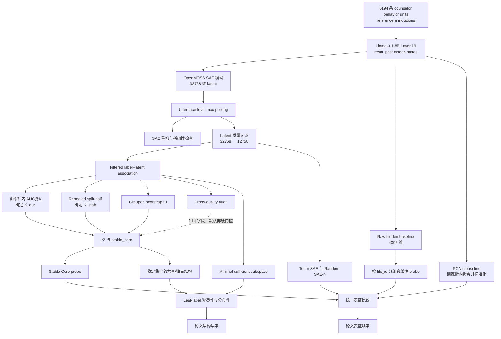

# 论文完整实验工作流（当前冻结口径）

> 版本：2026-07-13  
> 状态：实验主线草案，供论文 Methods、Experiments 与 Results 组织使用  
> 当前范围：表征抽取、SAE 质量检查、filtered latent pool、线性可解码性、稳定特征筛选、预测充分性、标签结构分析与稳健性对照  
> 暂不纳入：Feature Card/自动解释、标注不一致审查、因果干预或 steering。上述部分需完成进一步实验后另行决定是否进入论文。

## 1. 已冻结的论文口径

本版本采用以下固定选择。后续写作和结果整理若要改变其中任何一项，应先形成新的实验分支，不能把不同口径的结果混入同一主表。

1. **中心主张**：SAE 的价值不是获得高于 PCA 的分类性能，而是提供稳定、稀疏、可逐维审查的内部证据单元。本文比较预测性能，但不把“SAE 优于 PCA”作为贡献。
2. **候选空间**：主线采用 filtered latent pool，经 `K_auc → K_stab → K* → stable_core` 得到稳定候选。full-pool 复跑仅作历史敏感性尝试，不替代当前主线。
3. **模型层与聚合**：主实验固定为 Llama-3.1-8B 第 19 层 `blocks.19.hook_resid_post`，token 维度采用 utterance-level max pooling。mean pooling、其他 Llama 层和 GemmaScope 只作为稳健性或附录实验。
4. **标签范围**：主结论只针对 7 个 leaf/atomic 标签：`RES, REC, QUO, QUC, GI, SU, AF`。父标签 `RE, QU` 只用于层级一致性检查，不进入最终 leaf-label macro 主结论。
5. **证据边界**：当前结果属于相关性、结构性和 probe-space 预测充分性证据。不能据此声称单个 latent 等同于 MISC 概念，也不能声称已经发现因果机制。

## 2. 论文要回答的实验问题

当前实验主线围绕三个相互衔接、但证据等级不同的问题展开。

### 2.1 行为信息是否保留在 SAE 表征中

比较原始 hidden state、完整 SAE、不同规模的筛选 SAE 子空间、stable core、PCA 和随机 SAE 子空间，判断 MISC reference labels 是否能够从这些表示中被线性读出。

这一部分回答的是 **decodability**，不能单独证明行为概念被模型以人类相同的方式理解。

### 2.2 行为信息是否集中在稳定、非随机的稀疏子空间中

通过训练折内关联排序、AUC@K 平台、重复 split-half、grouped bootstrap 和跨质量来源检查，确定每个标签的候选预算 `K*`，再筛选 `stable_core`。

这一部分回答的是 **稳定关联与稀疏集中性**。它比固定 Top20 更可复现，但仍不是语义命名或因果证据。

### 2.3 不同 MISC 标签呈现怎样的内部组织结构

结合 minimal sufficient subspace、label–latent overlap、独占/共享 latent、父子层级一致性与标签间相似度，比较不同 leaf 标签的紧凑性、分布性和共享结构。

这一部分回答的是 **预测充分性与结构组织**。父标签导致的确定性共现必须与真正的 leaf-label 共享分开报告。

## 3. 完整实验流程总览



## 4. 阶段一：数据与 reference labels

### 4.1 数据对象

- 数据根目录：`data/mi_quality_counseling_misc`
- 合并记录：`outputs/misc_full_sae_eval/records.jsonl`
- 标签矩阵：`outputs/misc_full_sae_eval/label_matrix.csv`
- 样本数：6,194
- 来源文件数：252，其中 high 153 个、low 99 个
- `source_split`：high 4,169 条、low 2,025 条
- 样本单位：单条 counselor `unit_text`

当前标签来自 LLM 分段后的 MISC 2.1 标注产物，尚不能称为独立人工 gold labels。论文统一使用 **reference labels** 或 **reference annotations**。

### 4.2 标签角色

| 角色 | 标签 | 论文用途 |
|---|---|---|
| Leaf/atomic 主标签 | `RES, REC, QUO, QUC, GI, SU, AF` | 主结果、逐标签比较、7-label macro |
| 父标签 | `RE, QU` | 父子层级一致性与敏感性分析 |
| 非核心聚合 | `OTHER` | 不进入主结论 |

`RE == RES OR REC`，`QU == QUO OR QUC`。因此 9 标签宏平均可以作为工程审计结果，但论文最终主表必须另算 7 个 leaf 标签的 macro，不能直接把当前 9-label macro 当作最终主结论。

### 4.3 数据限制

`records.jsonl` 不包含前一句 client utterance。`RES`、`REC` 和父标签 `RE` 的操作性定义依赖来访者前文，因此本文只能讨论当前 counselor utterance 中与这些 reference labels 相关的可解码线索，不能据此判断完整的上下文反映功能。

规范化 exact duplicate 较多，同一模板可能跨样本重复出现。分组交叉验证用于减少同源会话泄漏，但不能完全消除模板频率对表征的影响。

## 5. 阶段二：主模型表示与 SAE 特征

### 5.1 固定配置

| 项目 | 固定值 |
|---|---|
| 基础模型 | Llama-3.1-8B |
| 模型位置 | `D:\project\NLP_v3\NLP_data\Llama-3.1-8B` |
| SAE | `OpenMOSS-Team/Llama3_1-8B-Base-LXR-8x` |
| SAE 子目录 | `Llama3_1-8B-Base-L19R-8x` |
| Hook | `blocks.19.hook_resid_post` |
| Hidden 维度 | 4,096 |
| SAE 维度 | 32,768 |
| Token 聚合 | max pooling |
| 最大序列长度 | 128 |

关键对齐产物：

- `outputs/misc_full_sae_eval/feature_store/utterance_activations.pt`：`[6194, 4096]`
- `outputs/misc_full_sae_eval/feature_store/utterance_features.pt`：`[6194, 32768]`
- `outputs/misc_full_sae_eval/label_matrix.csv`：第 0 维行顺序与以上两个张量严格一致

### 5.2 SAE 质量检查

在进入标签关联分析前，先检查 SAE 是否对当前 hidden state 提供可用重构。主要指标包括：

- reconstruction MSE；
- cosine similarity；
- explained variance 的各实现口径；
- latent `L0` 与 dead ratio；
- SAE 重构替换后的 CE loss delta 与 KL divergence。

这些指标用于确认 SAE 工程链和重构质量，不用于证明 latent 具有 MISC 语义。

主要产物：

- `outputs/misc_full_sae_eval/metrics_structural.json`
- `outputs/misc_full_sae_eval/metrics_ce_kl.json`
- `outputs/misc_full_sae_eval/validation/`

## 6. 阶段三：Filtered Latent Pool

### 6.1 过滤目的

原始 32,768 个 latent 中包含极少激活、近零方差、几乎总是激活或由少量异常值支配的维度。主线先按与标签无关的激活质量规则过滤，再计算 label–latent association，避免把明显不可用维度带入后续稳定性筛选。

过滤规则包括：

- `activation_rate >= 0.001`；
- `active_count >= 10`；
- `activation_rate <= 0.995`；
- `std >= 1e-8`；
- 限制异常值比例；
- 限制 Top1/Top5 样本对总激活的支配程度。

当前结果保留 12,758 / 32,768 个 latent，保留率约 38.9%。

### 6.2 主产物

- `outputs/misc_full_sae_eval/functional/misc_label_mapping_filtered/feature_filter_summary.json`
- `outputs/misc_full_sae_eval/functional/misc_label_mapping_filtered/feature_filter_audit.csv`
- `outputs/misc_full_sae_eval/functional/misc_label_mapping_filtered/latent_label_matrix.csv`

full-pool 结果保留为敏感性记录，但本论文主线不在 filtered 与 full-pool 之间混用候选集合。

## 7. 阶段四：Label–Latent Association

对每个 filtered latent 和每个标签计算单变量关联。主指标分工如下：

| 指标 | 作用 | 不能支持的结论 |
|---|---|---|
| `cohens_d` | 目标与非目标样本的标准化激活差异；正值表示目标标签更高激活 | 不能证明语义等价 |
| `directional_auc` | 单 latent 的方向无关区分度 | 不能证明因果机制 |
| `p_value` / FDR | 控制大量 label–latent 检验的统计错误 | 显著不等于效应大或可解释 |
| Precision@10/50 | 检查最高激活样本中的目标标签富集 | 易受标签频率与重复模板影响 |

主排序采用 **positive Cohen's d**。`abs_cohens_d` 和 `directional_auc` 只作为结构或敏感性指标，不能把负向 latent 直接解释成“目标标签特征”。

## 8. 阶段五：统一表征比较

### 8.1 比较对象

1. Hidden State：完整 4,096 维原始 hidden state；
2. Full SAE：完整 32,768 维 SAE；
3. Top-n SAE：每个训练折内按 positive Cohen's d 排序选择 `n = 10, 20, 50, 100, 200`；
4. Stable Core SAE：使用稳定筛选得到的每标签 latent 集合；
5. PCA-n：在训练折内拟合 PCA，降维后再次标准化；
6. Random SAE-n：从 filtered pool 中随机抽取同规模 latent，当前使用 20 个随机种子重复。

### 8.2 公平性设置

- 5-fold `StratifiedGroupKFold`；
- 按 `file_id` 分组，避免同一来源文件跨训练折与测试折；
- 所有 scaler、PCA 和 Top-n 排序只在训练折拟合；
- balanced logistic regression；
- 指标：ROC-AUC、PR-AUC、F1、Balanced Accuracy；
- AUC 作为主要连续排序指标，PR-AUC 对 `SU` 等低频标签尤其重要；
- F1 依赖分类阈值，不能单独替代 AUC/PR-AUC。

### 8.3 历史 9-label 结果

现有 `representation_probe_comparison_stable_core` 报告的是 9 标签 macro。其主要审计结果为：Hidden State AUC 0.900、Full SAE 0.890、Stable Core SAE 0.869、Top-100 SAE 0.883、PCA-100 0.934、Random SAE-100 0.693。

这些结果已经足以否定“SAE 的预测性能优于 PCA”，并支持“有针对性筛选的 SAE 子空间明显优于随机 SAE 子空间”。该 9-label macro 现在只作为父标签敏感性结果，不再作为论文主表。

历史产物：

- `outputs/misc_full_sae_eval/interpretability/representation_probe_comparison_stable_core/probe_fold_metrics.csv`
- `outputs/misc_full_sae_eval/interpretability/representation_probe_comparison_stable_core/probe_summary_by_label.csv`
- `outputs/misc_full_sae_eval/interpretability/representation_probe_comparison_stable_core/probe_macro_summary.csv`

### 8.4 2026-07-13 冻结的 7-leaf 表征比较

论文主口径固定为 `RES, REC, QUO, QUC, GI, SU, AF`，排除父标签 `RE, QU`。冻结包：

- `outputs/misc_full_sae_eval/interpretability/representation_comparison_frozen_leaf7_20260713/`
- 逐标签结果：`final_metrics_by_label.csv`
- 7-leaf 宏平均：`final_macro_metrics.csv`
- 折级源数据：`source_probe_fold_metrics_leaf7.csv`
- 协议审计：`protocol_audit.csv`
- 最终图：`figures/representation_comparison_leaf7.png` 与 `.pdf`
- 复画脚本：`plot_frozen_representation_comparison.py`
- 完整性校验：`SHA256SUMS.txt`

主表代表点如下；Top-n、PCA-n 和 Random SAE-n 的全部 `n = 10, 20, 50, 100, 200` 数值保存在源 CSV 中。

| 表征 | n | AUC | PR-AUC | F1 | Balanced Accuracy | 论文状态 |
|---|---:|---:|---:|---:|---:|---|
| Hidden State | full | 0.889 | 0.628 | 0.595 | 0.792 | confirmatory baseline |
| Full SAE | full | 0.879 | 0.538 | 0.515 | 0.800 | confirmatory baseline |
| Top-n SAE | 100 | 0.873 | 0.542 | 0.499 | 0.803 | confirmatory；折内排序 |
| Stable Core SAE | mean 31.9 | 0.858 | 0.545 | 0.486 | 0.794 | **exploratory only** |
| PCA-n | 100 | 0.928 | 0.636 | 0.552 | 0.850 | confirmatory；折内 PCA |
| Random SAE-n | 100 | 0.688 | 0.230 | 0.266 | 0.639 | confirmatory random control |

公平性审计中，35 个 leaf-label × outer-fold 的数据签名完全一致；分类器固定为 balanced logistic regression（`C=1.0`, `solver=liblinear`, `max_iter=1000`），主随机种子为 42，指标统一为 ROC-AUC、PR-AUC、阈值 0.5 的 F1 和 Balanced Accuracy。所有输入使用训练折统计量标准化；PCA 额外在训练折拟合 PCA，并用训练折 PCA score 再次标准化。Top-n SAE 的 positive Cohen's d 排序只使用对应外层训练折；Random SAE-n 是与标签和数据无关的 filtered-pool 随机抽样。

**唯一未通过项**：当前 Stable Core SAE 使用在全分析数据上生成的监督式 stable-core 清单，没有在每个 outer fold 内嵌套重选。因此冻结状态为 `FROZEN_WITH_STABLE_CORE_LIMITATION`，不能把 Stable Core 行写成完全无泄漏的 confirmatory 性能估计。它只作为预先筛得候选集合的探索性读出结果；若要升级为 confirmatory，必须新增 nested outer-fold stable-core selection 后重算该行。

## 9. 阶段六：K 选择与 Stable Core

### 9.1 `K_auc`：预测性能平台

对每个标签在训练折内按 positive Cohen's d 排序，计算 `K = 0..100` 的 held-out AUC 曲线。设：

```text
best_auc = max AUC(k), k <= 100
target_auc = best_auc - max(0.01, SE(best_auc))
K_auc = 达到 target_auc 的最小 k
```

`K_auc` 给出接近最佳预测性能的最小候选预算，避免固定 Top20 或为了很小增益不断扩大集合。

### 9.2 `K_stab`：集合稳定性平台

按 `source_file` 分组执行 50 次 repeated split-half。每次在两个半样本中独立重算关联排序，并比较 TopK 集合 Jaccard。

```text
K_stab = 最小 k，满足：
  k >= K_auc
  passes_null_2sd_rate >= 0.95
  observed_jaccard_p05 >= 0.40
```

### 9.3 `K*` 与 stable core

```text
若存在 K_stab：K* = K_stab
否则：K* = K_auc，并标记 performance_only_unstable
```

在 full-data positive Cohen's d TopK* 内，latent 进入 `stable_core` 需满足：

```text
inclusion_frequency >= 0.70
cohens_d_ci_lo > 0
```

`0.40 <= inclusion_frequency < 0.70` 且 CI 为正的 latent 只标记为 `boundary_candidate`，不进入主解释集合。cross-quality 当前是审计字段，不是默认硬门槛。

### 9.4 当前稳定集合

| 标签 | K* | 选择状态 | Stable core | 论文角色 |
|---|---:|---|---:|---|
| RE | 66 | stable | 54 | 父标签审计 |
| RES | 45 | performance-only unstable | 15 | 主标签 |
| REC | 56 | stable | 47 | 主标签 |
| QU | 28 | stable | 26 | 父标签审计 |
| QUO | 36 | stable | 32 | 主标签 |
| QUC | 59 | stable | 45 | 主标签 |
| GI | 72 | performance-only unstable | 26 | 主标签 |
| SU | 60 | performance-only unstable | 31 | 主标签 |
| AF | 33 | stable | 27 | 主标签 |

全 9 标签共有 303 条 stable label–latent 边、225 个 unique latent。仅 7 个 leaf 标签共有 223 条 stable 边、210 个 unique latent。`RES`、`GI` 和 `SU` 没有达到标签级集合稳定平台，但仍存在满足单 latent inclusion 与 bootstrap CI 条件的 stable-core 成员；不能写成这些标签“没有稳定 latent”。

主产物：

- `outputs/cross_val/stable_topk_selection/stable_k_by_label.csv`
- `outputs/cross_val/stable_topk_selection/stable_topk_latent_set.csv`
- `outputs/cross_val/stable_topk_selection/stable_topk_global_union.csv`

## 10. 阶段七：Minimal Sufficient Subspace

### 10.1 问题定义

`minimal_sufficient_subspace_v2` 测量最少多少 latent 可以接近完整 filtered candidate pool 的 probe 表现。每折先训练完整候选 probe，再依据训练折中的线性贡献进行 additive greedy selection。

充分条件同时约束：

- `AUC >= 0.70`；
- `AUC >= full_candidate_auc - 0.02`；
- `AUPRC >= full_candidate_auprc - 0.03`；
- `Precision@50 lift >= full_candidate_precision_lift_at_50 - 0.05`。

这一定义是 **predictive sufficiency**，不是因果 sufficiency。

### 10.2 Leaf 标签结果

| 标签 | 每折 minimal k 均值 | 中位数 | 范围 | 当前解释 |
|---|---:|---:|---:|---|
| RES | 28.2 | 21 | 14–47 | 分布较广，且依赖缺失的 client context |
| REC | 17.2 | 14 | 9–29 | 中等规模分布式子空间 |
| QUO | 10.6 | 10 | 8–14 | 相对紧凑 |
| QUC | 16.8 | 15 | 12–25 | 中等规模分布式子空间 |
| GI | 18.2 | 17 | 15–24 | 中等规模，可能包含内容与功能混合线索 |
| SU | 26.4 | 24 | 8–43 | 稀有标签，跨折波动较大 |
| AF | 12.2 | 12 | 10–16 | 相对紧凑 |

不同标签的 minimal k 差异可以作为结构发现，但不能自动解释为心理功能复杂度。它也可能受到标签频率、reference annotation 噪声、上下文缺失和线性 probe 假设影响。

主产物：

- `outputs/misc_full_sae_eval/interpretability/minimal_sufficient_subspace_v2_filtered/minimal_sufficient_summary_v2.csv`
- `outputs/misc_full_sae_eval/interpretability/minimal_sufficient_subspace_v2_filtered/minimal_sufficient_selected_latents_v2.csv`
- `outputs/misc_full_sae_eval/interpretability/minimal_sufficient_subspace_v2_filtered/minimal_sufficient_fold_results_v2.csv`
- `outputs/misc_full_sae_eval/interpretability/minimal_sufficient_subspace_v2_filtered/minimal_sufficient_curves_v2.csv`

## 11. 阶段八：标签结构分析

结构分析包括：

- label fragmentation：每个标签需要多少候选 latent；
- latent overlap：同一 latent 是否进入多个标签集合；
- label-pair Jaccard：不同标签 TopK 或 stable core 的集合重叠；
- effect-vector Pearson/Spearman similarity；
- exclusive、family-shared、cross-family 等 latent role；
- `RE → RES/REC`、`QU → QUO/QUC` 的父子一致性。

论文主分析应使用 **stable-core 或由 K* 决定的集合**。旧的固定 Top20 mapping structure 可以保留为历史或可视化敏感性结果，但不能与 stable-core 结构指标混称同一方法。

父子标签共享首先反映标签定义中的确定性共现，不能作为模型自主发现层级结构的唯一证据。主文应优先报告 leaf–leaf 共享，并把父子关系单列为 consistency audit。

主产物：

- `outputs/misc_full_sae_eval/interpretability/mapping_structure_filtered/`
- `outputs/cross_val/stable_topk_selection/stable_topk_latent_set.csv`
- 后续需生成：基于 stable core、排除父标签确定性重叠的最终结构表与图（`TBD`）

## 12. 稳健性与附录实验

以下实验不改变主定义，只用于判断结论是否依赖模型、层或 pooling。

### 12.1 Pooling 敏感性

- 主线：Layer 19 + max pooling；
- 附录：mean pooling 与 max/mean nested comparison；
- 目标：判断 decodability 与 stable-set 结论是否由 max pooling 偏好少量高峰 token 所驱动。

### 12.2 Layer 敏感性

- 主线：Layer 19；
- 附录：已有 layer probe，以及 L15/L24 的定向复核；
- 目标：说明 Layer 19 是固定分析层，而不是从最终 MISC 结果中事后挑选的最优层。

### 12.3 跨模型稳健性

Gemma3-4B + GemmaScope Layer 18 已有完整技术验证，可作为模型特异性对照。它不与 Llama stable-core latent 做逐维身份对齐，而比较标签层面的可解码性、紧凑性和结构趋势。

主要产物：

- `outputs/gemma3_l18_gemmascope_sae_eval/`
- `outputs/gemma3_l18_gemmascope_sae_eval/validation/gemma_scope_validation_summary.json`
- `outputs/gemma3_l18_gemmascope_sae_eval/interpretability/model_specificity_comparison/`

是否把 Gemma 放入主文，取决于最终篇幅和跨模型结果是否真正支持相同的标签级结论；默认放附录或 robustness subsection。

## 13. 历史尝试与当前处理

| 历史分支 | 主要问题 | 当前处理 |
|---|---|---|
| `data/mi_re` / 早期 cactus 流程 | 数据任务与当前 6,194 条 MISC 主数据不一致 | 作为 legacy，不进入论文主线 |
| 固定 Top20 latent | K 缺乏标签自适应和稳定性依据 | 被 `K_auc → K_stab → K*` 替代 |
| 直接使用 full 32,768 latent 候选池 | 大量 rare/near-zero/异常值维度进入候选 | 主线改为 filtered pool；full-pool 仅作敏感性记录 |
| `abs_cohens_d` 作为目标特征排序 | 会混入目标标签低激活的负向关联 latent | 主筛选固定为 positive Cohen's d |
| 不分组或只做普通 StratifiedKFold | 同一来源文件可能跨训练与测试 | 主线固定 `StratifiedGroupKFold(file_id)` |
| 把高 F1/AUC 直接写成概念对齐 | decodability 被错误提升为语义或机制结论 | 仅写线性可解码信息与预测充分性 |
| 旧 `minimal_sufficient_subspace_v2` | 候选来源与当前 filtered pool 不完全一致 | 当前 canonical 目录为 `minimal_sufficient_subspace_v2_filtered` |
| PCA 实现口径不统一 | PCA 后是否标准化会改变 probe 公平性 | 主线固定训练折内 PCA 后再次标准化 |
| 将父标签与 leaf 标签等权解释 | 父子确定性共现抬高结构重叠 | 主结论只用 7 leaf；父标签只作审计 |
| max/mean、多层、full-pool 同时进入主结果 | 研究问题扩张，结果口径难以冻结 | L19-max 为主，其余降为 robustness |
| Feature Card、标注审查与因果干预 | 尚需进一步实验和人工确认 | 本版本不展开，后续单独决策 |

## 14. 论文主表与主图规划

### 14.1 主表

1. **Table 1：数据与标签统计**——7 leaf 标签为主，父标签单列。
2. **Table 2：统一表征比较**——Hidden、Full SAE、Top-n SAE、Stable Core、PCA-n、Random SAE-n；报告 7-leaf macro 与逐标签结果。
3. **Table 3：稳定筛选结果**——每个 leaf 标签的 `K_auc, K_stab, K*`、stable-core 数量和状态。
4. **Table 4：预测充分性与结构**——minimal k、稳定性、独占/共享数量和非层级 overlap。

### 14.2 主图

1. **Figure 1：整体实验流程**——从 reference labels 到 stable sparse evidence。
2. **Figure 2：表示规模–性能曲线**——Top-n SAE、PCA-n 与 Random SAE-n；Hidden、Full SAE、Stable Core 为参考线。
3. **Figure 3：每标签 K 选择与稳定性**——AUC@K、Jaccard/null 和最终 K*。
4. **Figure 4：Leaf-label 结构图**——只展示排除父标签确定性共现后的共享、独占与 minimal-k 差异。

Feature Cards、标注案例和 intervention 图不在本版本规划中。

## 15. 当前已完成与待冻结事项

| 模块 | 当前状态 | 进入论文前动作 |
|---|---|---|
| 6,194 条数据与张量对齐 | 已完成 | 固定输入文件 hash/manifest |
| L19 max-pooling SAE 特征 | 已完成 | 固定模型、SAE checkpoint 与环境 |
| Filtered latent pool | 已完成 | 固定过滤配置与 12,758 latent 清单 |
| Label–latent association | 已完成 | 固定 positive Cohen's d 主排序 |
| AUC@K 与 repeated split-half | 已完成 | 固定 K 上限、随机种子与结果目录 |
| Bootstrap CI 与 cross-quality | 已完成 | 明确 cross-quality 只作 audit |
| Stable core | 已完成 | 导出 7-leaf 专用汇总表 |
| 统一表示比较 | 已冻结 7-leaf 包 | Stable Core 行仅作 exploratory；confirmatory 版本需 nested outer-fold selection |
| Minimal sufficient subspace | 已完成 | 只报告 predictive sufficiency；整理 leaf 表 |
| Mapping structure | 有 filtered Top20 和 stable-set 原始数据 | 生成 stable-core、leaf-only、去父子确定性重叠的最终图表 |
| Pooling/layer/Gemma robustness | 已有部分结果 | 决定附录保留项并统一统计口径 |

## 16. 推荐复现顺序

所有 `run_*.py` 与 `test_*.py` 必须使用 `qwen-env-py311`。以下命令展示主流程顺序；正式冻结时还应保存完整 CLI、git revision、输入 hash、随机种子和输出 manifest。

```powershell
# 1. GPU：主数据、L19 hidden states 与 SAE features
conda run -n qwen-env-py311 python run_sae_evaluation.py `
  --model-dir D:\project\NLP_v3\NLP_data\Llama-3.1-8B `
  --device cuda `
  --data-dir data/mi_quality_counseling_misc `
  --data-format misc_full `
  --label-mode misc_multilabel `
  --batch-size 4 `
  --max-seq-len 128 `
  --full-structural `
  --checkpoint-topk-semantics hard `
  --output-dir outputs/misc_full_sae_eval

# 2. CPU：filtered label-latent association
conda run -n qwen-env-py311 python run_misc_filtered_label_mapping.py

# 3. CPU：训练折内 AUC@K
conda run -n qwen-env-py311 python run_misc_full_representation_probe.py `
  --include-sae-ranked-subspaces `
  --subspace-max-n 100 `
  --subspace-step 1 `
  --subspace-rankings cohens_d directional_auc `
  --subspace-n-jobs 8

# 4. CPU：集合稳定性、bootstrap 与跨质量审计
conda run -n qwen-env-py311 python run_cross_val_topk_reproducibility.py `
  --top-k-grid-max 100 `
  --n-repeats 50

conda run -n qwen-env-py311 python run_cross_val_bootstrap_ci.py `
  --top-k 100 `
  --n-bootstrap 2000

conda run -n qwen-env-py311 python run_cross_val_quality_split.py `
  --top-k 100

conda run -n qwen-env-py311 python run_cross_val_stable_topk_selection.py

# 5. CPU：统一表示比较
conda run -n qwen-env-py311 python run_misc_representation_probe_comparison.py `
  --labels RES REC QUO QUC GI SU AF `
  --top-ns 10 20 50 100 200 `
  --folds 5 `
  --split-policy stratified-group-kfold `
  --group-column file_id `
  --random-repeats 20 `
  --output-dir outputs/misc_full_sae_eval/interpretability/representation_probe_comparison_stable_core_leaf7

# 6. CPU：filtered-pool predictive sufficiency
conda run -n qwen-env-py311 python run_misc_minimal_sufficient_subspace_v2.py `
  --labels RES REC QUO QUC GI SU AF `
  --candidate-policy filtered_topk_only `
  --output-dir outputs/misc_full_sae_eval/interpretability/minimal_sufficient_subspace_v2_filtered_leaf7

# 7. CPU：filtered mapping structure；最终论文还需 stable-core leaf-only 汇总
conda run -n qwen-env-py311 python run_misc_mapping_structure_filtered.py
```

代码改动后的验证顺序：先用相同环境执行 `python -m py_compile <file>`，再运行对应的 `test_*_smoke.py`。全量主特征抽取需要 GPU；其余多数统计分析可在 CPU 上运行。

## 17. 结果冻结门槛

进入正式论文 Results 写作前，至少满足：

- 7-leaf 表征比较可由固定命令复现；
- scaler、PCA、Top-n 排序均严格限制在训练折；
- Stable Core 如进入 confirmatory 主结论，必须在每个 outer fold 的训练数据内完整重选；当前冻结包未满足，故只作 exploratory；
- 主要方法比较有 fold-level 配对不确定性；
- stable core 的输入、K 规则、阈值和输出文件被冻结；
- stable-core 结构图排除了父标签确定性共现造成的虚假共享；
- `RES/REC` 的文字结论明确标注缺少 client context；
- PCA 的性能优势被如实报告；
- 所有主张均能指向具体 CSV/JSON/figure；
- 全文不把 reference annotations 写成人工 gold；
- 全文不把线性可解码性、TopK 稳定性或 minimal sufficient subspace 写成因果机制。

## 18. 当前可使用的中心结论

在当前 Llama-3.1-8B Layer-19 max-pooling 设置下，完整 SAE 保留了大量可从原始 hidden state 读出的 MISC reference-label 信息。经过与标签无关的激活质量过滤、训练折内关联排序和重采样稳定性筛选后，行为信息集中在明显优于随机 SAE 子空间的稳定稀疏特征集合中。不同 leaf 标签在达到接近完整候选池预测表现时需要不同数量的 latent，并呈现不同程度的集中、共享和分布式组织。

PCA 在当前线性预测任务上优于同规模 SAE 子空间，因此本文不把 SAE 定位为性能最优的降维方法。SAE 的研究价值在于把内部行为相关信号分解为稳定、稀疏、可进一步审查的候选证据单元。当前工作支持表征结构、稳定关联与预测充分性结论，不支持单 latent–标签等价、完整心理功能理解或因果机制主张。
