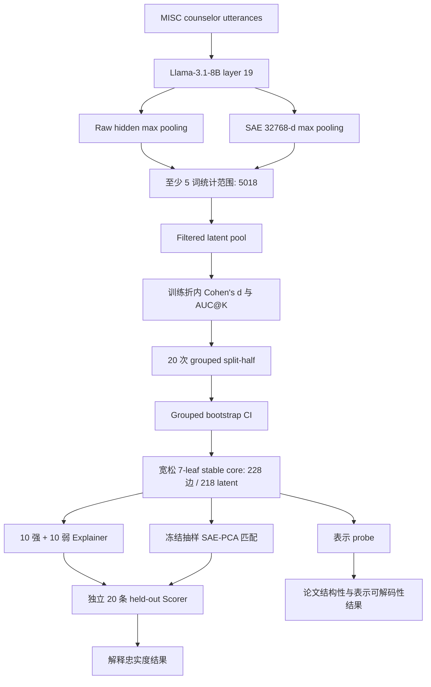

# MISC–SAE 当前实验需求与完整工作流

> Status: Current / Single Source of Truth
>
> Effective date: 2026-07-19
>
> This is the only valid requirements and implementation entry for the experiment. If any code comment, AGENTS.md section, report, command example, or historical document conflicts with this file, this file wins.

## 1. 冻结决策

本轮论文实验固定为：

- 只运行 Llama-3.1-8B，不运行 Gemma；
- 只使用第 19 层 `blocks.19.hook_resid_post`，不比较其他层；
- utterance 表征使用 token 维度 max pooling；
- 数据使用 `data/mi_quality_counseling_misc`；
- 统计范围只保留至少 5 个空格分词词项的 counselor `unit_text`，共 5018 条；
- 主结果只分析 7 个叶标签：`RES, REC, QUO, QUC, GI, SU, AF`；
- stable-core 使用当前宽松成员口径，20 次 grouped split-half；
- 全量解释使用 GPT-5.5、`reasoning_effort=low`；
- 每个单元使用独立、ephemeral、零工具调用的 Codex 请求；
- Explainer 使用 10 条强响应句＋10 条弱正响应句；Scorer 使用独立 20 条 held-out；
- SAE–PCA 只做冻结抽样匹配，不扩展为全量 PCA 解释；
- 不运行 shuffled/empty explanation baseline，也不为解释指标计算 bootstrap CI；
- 所有主张限定为相关性、结构性、表示可解码性和解释忠实度，不写成因果证明。

## 2. 唯一数据与产物根

当前完整实验的唯一统计根目录是：

`outputs/rerun_new_dataset_20260716/min5_words`

固定输入：

| 文件 | 形状/数量 | 用途 |
|---|---:|---|
| `records.jsonl` | 5018 行 | 文本、会话分组、质量来源和标签 provenance |
| `label_matrix.csv` | 5018 行 | 多标签目标与 `file_id` 分组 |
| `feature_store/utterance_features.pt` | `[5018, 32768]` | SAE utterance features |
| `feature_store/utterance_activations.pt` | `[5018, 4096]` | Llama layer-19 raw hidden utterance representation |

`source_split` 表示 high/low 质量来源，不是训练/测试划分。

## 3. 整体流程



## 4. 阶段一：数据与 Llama layer-19 特征

### 输入与范围

原始新数据运行包含 6194 条 counselor utterance。使用 `run_min_word_statistical_scope.py` 按空格分词保留词数不少于 5 的样本：

- 保留 5018 条；
- 归档 1176 条；
- 特征、hidden、标签和 records 同步按行过滤。

SAE 配置固定为 `config/sae_config.json`。该文件必须保持 OpenMOSS `Llama3_1-8B-Base-L19R-8x`、`blocks.19.hook_resid_post`、`d_model=4096`、`d_sae=32768`、JumpReLU 和 `aggregation=max`。

```powershell
conda run -n qwen-env-py311 python run_sae_evaluation.py `
  --sae-config config/sae_config.json `
  --data-dir data/mi_quality_counseling_misc `
  --data-format misc_full `
  --label-mode misc_multilabel `
  --batch-size 4 --max-seq-len 128 `
  --aggregation max --full-structural `
  --checkpoint-topk-semantics hard `
  --output-dir outputs/rerun_new_dataset_20260716/full_sae_eval
```

```powershell
conda run -n qwen-env-py311 python run_min_word_statistical_scope.py `
  --source-root outputs/rerun_new_dataset_20260716/full_sae_eval `
  --output-root outputs/rerun_new_dataset_20260716/min5_words `
  --minimum-words 5
```

层和模型已经冻结，不再运行 layer selection，也不启动 Gemma 相关入口。任何复跑都必须保持 Llama layer 19、`blocks.19.hook_resid_post` 和 max pooling 不变。

## 5. 阶段二：Filtered latent pool

入口：`run_misc_filtered_label_mapping.py`

该阶段对 32768 个 SAE 维度进行激活质量过滤，再为 7 个叶标签计算关联统计。主输出：

- `functional/misc_label_mapping_filtered/feature_filter_audit.csv`
- `functional/misc_label_mapping_filtered/feature_filter_summary.json`
- `functional/misc_label_mapping_filtered/latent_label_matrix.csv`

后续候选只能来自 `keep=True` 的 12589 个 filtered latent。

## 6. 阶段三：AUC@K 与宽松 Stable Core

### 6.1 `K_auc`

使用 `run_cohensd_auc_k_sensitivity.py`，在训练折内按正向 Cohen's d 排序，计算 `K=0..200` 的 held-out AUC。`K_auc` 是首个达到 `best_auc - max(0.01, SE)` 的 K。

### 6.2 20 次 grouped split-half

使用 `run_cross_val_topk_reproducibility.py`：

- 按 `file_id` 分组；
- 重复 20 次；
- 随机种子 42；
- 对每个 K 记录 Jaccard 和单 latent inclusion frequency。

### 6.3 Bootstrap 与跨质量审计

- `run_cross_val_bootstrap_ci.py`：按 `file_id` 分组执行 2000 次 bootstrap，检查 Cohen's d 的正向 CI；
- `run_cross_val_quality_split.py`：比较 high/low 来源，结果作为稳健性审计。

### 6.4 当前成员规则

对每个标签先确定 `K*`：存在集合稳定平台时取 `K_stab`，否则取 `K_auc`。标签整体是否达到集合平台不阻断其内部 latent。

在 full-data TopK* 内，成员只需满足：

```text
inclusion_frequency >= 0.70
cohens_d_ci_lo > 0
```

跨质量结果不参与成员剔除。主输出固定为：

`cross_val/stable_topk_selection_n20_relaxed_leaf7/stable_topk_latent_set.csv`

当前冻结结果：

| 标签 | K* | Stable-core 边 |
|---|---:|---:|
| RES | 55 | 14 |
| REC | 58 | 46 |
| QUO | 45 | 42 |
| QUC | 50 | 40 |
| GI | 85 | 26 |
| SU | 30 | 17 |
| AF | 58 | 43 |

共 228 条 label–latent 边、218 个去重 latent。下游解释以 218 个 latent 为候选全集。

### 6.5 固定筛选命令

以下命令组是 stable-core 的唯一生成方式。所有脚本均使用 `qwen-env-py311`，标签固定为 7 leaf。

```powershell
$ROOT = "outputs/rerun_new_dataset_20260716/min5_words"
$LABELS = @("RES", "REC", "QUO", "QUC", "GI", "SU", "AF")

conda run -n qwen-env-py311 python run_misc_filtered_label_mapping.py `
  --feature-store "$ROOT/feature_store/utterance_features.pt" `
  --records "$ROOT/records.jsonl" `
  --label-matrix "$ROOT/label_matrix.csv" `
  --output-dir "$ROOT/functional/misc_label_mapping_filtered" `
  --labels $LABELS

conda run -n qwen-env-py311 python run_cohensd_auc_k_sensitivity.py `
  --sae-features "$ROOT/feature_store/utterance_features.pt" `
  --label-matrix "$ROOT/label_matrix.csv" `
  --base-auc-curve "$ROOT/interpretability/ranked_sae_subspace_probe_k001_100_filtered/auc_by_k_curve_0_100.csv" `
  --output-dir "$ROOT/interpretability/cohensd_auc_k_sensitivity_1_200" `
  --labels $LABELS --start-k 101 --max-k 200

conda run -n qwen-env-py311 python run_cross_val_topk_reproducibility.py `
  --feature-store "$ROOT/feature_store/utterance_features.pt" `
  --label-matrix "$ROOT/label_matrix.csv" `
  --feature-filter-audit "$ROOT/functional/misc_label_mapping_filtered/feature_filter_audit.csv" `
  --reference-matrix "$ROOT/functional/misc_label_mapping_filtered/latent_label_matrix.csv" `
  --output-dir "$ROOT/cross_val/topk_reproducibility_n20" `
  --labels $LABELS --group-column file_id --top-k-grid-max 200 `
  --n-repeats 20 --random-state 42

conda run -n qwen-env-py311 python run_cross_val_bootstrap_ci.py `
  --feature-store "$ROOT/feature_store/utterance_features.pt" `
  --label-matrix "$ROOT/label_matrix.csv" `
  --feature-filter-audit "$ROOT/functional/misc_label_mapping_filtered/feature_filter_audit.csv" `
  --association "$ROOT/functional/misc_label_mapping_filtered/latent_label_matrix.csv" `
  --output-dir "$ROOT/cross_val/bootstrap_ci_n20" `
  --labels $LABELS --group-column file_id --top-k 200 `
  --n-bootstrap 2000 --random-state 42

conda run -n qwen-env-py311 python run_cross_val_quality_split.py `
  --feature-store "$ROOT/feature_store/utterance_features.pt" `
  --label-matrix "$ROOT/label_matrix.csv" `
  --feature-filter-audit "$ROOT/functional/misc_label_mapping_filtered/feature_filter_audit.csv" `
  --reference-matrix "$ROOT/functional/misc_label_mapping_filtered/latent_label_matrix.csv" `
  --output-dir "$ROOT/cross_val/cross_quality_validation_n20" `
  --labels $LABELS --top-k 200

conda run -n qwen-env-py311 python run_cross_val_stable_topk_selection.py `
  --auc-curve "$ROOT/interpretability/cohensd_auc_k_sensitivity_1_200/auc_by_k_0_200_combined.csv" `
  --topk-grid-summary "$ROOT/cross_val/topk_reproducibility_n20/repeated_split_topk_grid_summary.csv" `
  --inclusion-frequency "$ROOT/cross_val/topk_reproducibility_n20/topk_inclusion_frequency.csv" `
  --association-matrix "$ROOT/functional/misc_label_mapping_filtered/latent_label_matrix.csv" `
  --bootstrap-ci "$ROOT/cross_val/bootstrap_ci_n20/bootstrap_ci_by_label_latent.csv" `
  --cross-quality "$ROOT/cross_val/cross_quality_validation_n20/cross_quality_auc_comparison.csv" `
  --output-dir "$ROOT/cross_val/stable_topk_selection_n20_relaxed_leaf7" `
  --labels $LABELS --max-k 200
```

筛选验收必须同时满足：manifest 输入均指向 `$ROOT`、标签恰为 7 leaf、split-half 为 20 次、输出为 228 条 stable-core 边和 218 个去重 latent。

## 7. 阶段四：表示空间比较

入口：`run_misc_representation_probe_comparison.py`

比较：

- Raw Hidden；
- Full SAE；
- Top-n SAE；
- Stable Core SAE；
- Random SAE-n；
- PCA-n。

统一规则：

- 标签只用 7 leaf；
- 5-fold `StratifiedGroupKFold`，按 `file_id` 分组；
- 所有标准化只在训练折拟合；
- PCA 只在训练折拟合，并对训练折 PCA score 再标准化；
- Top-n 的 Cohen's d 排序只用训练折；
- random baseline 重复 20 次；
- 指标包括 ROC-AUC、PR-AUC、F1 和 Balanced Accuracy；
- 不能仅凭分类指标声称某种表示本质上更可解释。

当前正式刷新采用非覆盖式局部重跑：旧结果中的 Raw Hidden、Full SAE、Top-n SAE、PCA-n 和 Random SAE-n 使用相同5018条数据、相同7标签、相同5个 grouped folds、相同随机种子42及相同预处理，因此逐行原样复用；只用当前宽松 stable-core 重新拟合35个 Stable Core SAE label-fold probe。`reuse_and_refresh_audit.json` 必须验证配置、fold规模、标签阳性数、源文件hash、复用行数和当前 stable-core hash。

```powershell
conda run -n qwen-env-py311 python run_misc_representation_probe_comparison.py `
  --sae-features outputs/rerun_new_dataset_20260716/min5_words/feature_store/utterance_features.pt `
  --raw-hidden outputs/rerun_new_dataset_20260716/min5_words/feature_store/utterance_activations.pt `
  --label-matrix outputs/rerun_new_dataset_20260716/min5_words/label_matrix.csv `
  --filtered-association outputs/rerun_new_dataset_20260716/min5_words/functional/misc_label_mapping_filtered/latent_label_matrix.csv `
  --feature-filter-audit outputs/rerun_new_dataset_20260716/min5_words/functional/misc_label_mapping_filtered/feature_filter_audit.csv `
  --stable-core outputs/rerun_new_dataset_20260716/min5_words/cross_val/stable_topk_selection_n20_relaxed_leaf7/stable_topk_latent_set.csv `
  --labels RES REC QUO QUC GI SU AF `
  --top-ns 10 20 50 100 200 `
  --random-repeats 20 --folds 5 `
  --split-policy stratified-group-kfold --group-column file_id `
  --reuse-nonstable-from outputs/rerun_new_dataset_20260716/min5_words/interpretability/representation_probe_comparison_stable_core_leaf7_n20 `
  --output-dir outputs/rerun_new_dataset_20260716/min5_words/interpretability/representation_probe_comparison_stable_core_leaf7_n20_relaxed
```

正式结果目录为 `interpretability/representation_probe_comparison_stable_core_leaf7_n20_relaxed`。审计结果为 pass：3920条非 Stable fold结果逐行复用并与源表完全相同，35条 Stable Core SAE fold结果重算。当前 macro AUC：Raw Hidden `0.8865`、Full SAE `0.8762`、Stable Core SAE `0.8528`、最佳 Top-n SAE（n=100）`0.8655`、最佳 PCA-n（n=100）`0.9207`、Random SAE-n（n=200）`0.7409`。Stable Core SAE 相对 Raw Hidden 为 `-0.0337`，相对 Full SAE 为 `-0.0234`，相对 Random SAE-200 为 `+0.1119`。

## 8. 阶段五：Stable-core 自然语言解释与忠实度

唯一入口：`run_contrastive_faithfulness_v2.py`

每个去重 stable-core latent：

1. Explainer 查看 10 条强响应句与 10 条弱正响应句；
2. 只归纳区分两组的最窄条件，不获知 SAE、标签或真实数值；
3. 冻结解释；
4. 独立 Scorer 请求查看冻结解释与 20 条未见句子；
5. Scorer 给每条句子预测 0–100 相对匹配分；
6. 离线计算 Spearman、Pearson、响应/控制 AUROC 和 high–weak 排序准确率。

模型只允许看到匿名 feature ID、句子文本、强/弱相对组别和“口语/转录对话”背景。不得暴露 SAE/PCA 身份、latent/component 编号、MISC 标签、响应值、响应排名、token 激活、数据行号、来源文件或预期解释。功能证据不足时优先采用更简单的词汇、句法、模板、话语标记或转录伪影解释。

Scorer 的 20 条 held-out 固定为 5 high、5 mid、5 weak-positive、5 low-response control。Explainer 与 Scorer 的行、规范化文本和 ID 必须完全不重叠；Scorer 只预测完整句子的 0–100 匹配分，不预测 token 激活。

held-out packet 必须在任何 Explainer 请求之前完成冻结。固定顺序为：先按 `source_file` 划分 discovery/held-out，再一次性选完 discovery 与 held-out 四层样本，保存私有 truth；随后使用独立的 `presentation_seed=v3-heldout-order` 对 20 条 held-out 做确定性随机排列，并且只在排列完成后赋公开 `H001...H020`。公开 Scorer packet 的每条样本只能包含不透明 `sample_id` 与 `text`，不得包含 stratum、真实响应、行号、rank、标签、source_file、latent/component 编号或任何可恢复分层顺序的字段。Scorer task 必须从已冻结的 `public_packets/scorer_packets.jsonl` 构建，不能从私有 truth 即时生成。

冻结产物固定为：

- `private/master_packets.jsonl`：discovery 与 held-out 的私有审计信息；
- `private/heldout_truth.jsonl`：按公开 ID 索引的私有 stratum 与真实响应；
- `public_packets/explainer_packets.jsonl`：Explainer 可见 packet；
- `public_packets/scorer_packets.jsonl`：Scorer 可见 packet；
- `packet_manifest.json`：packet version、presentation seed 和逐 feature SHA-256；
- `packet_integrity_audit.json`：公开字段、5/5/5/5、随机排列、hash 以及 discovery/held-out 行/规范化文本/source_file 三重不重叠审计。

Scorer 输出验证不得要求数组顺序，也不得以 `zip(predictions, truth)` 对齐。验证器必须检查 ID 唯一性与精确集合、公开文本 hash 和证据 span，再以 `sample_id` join 到私有 truth 后计算指标。未来 shuffled/empty/generic explanation baseline 必须复用完全相同的冻结公开 Scorer packet，禁止重新采样或重新排列。

Scorer 只能看到冻结解释中的 `short_name`、`surface_or_linguistic_hypothesis`、`behavioral_or_discourse_hypothesis`、`primary_explanation` 与 `explanation_type`。不得向 Scorer 暴露 `contrastive_explanation`、必要/典型条件、不足条件、发现集样本划分、对比证据、备选解释、混杂因素、局限或 Explainer 自评置信度。该限制用于避免 Scorer 直接复述 Explainer 已整理的边界、反例和可靠性判断。

2026-07-18 的去锚定 Scorer 复跑 `interpretability/contrastive_latent_faithfulness_v2_gpt55_low_full218_scorer_deanchored_20260718` 虽然移除了已废除解释字段并达到 207/207，但 held-out ID 仍按 `high → mid → weak → control` 顺序编码，因此同样 superseded，只能作为历史诊断，不得作为主解释忠实度结果。更早的 `contrastive_latent_faithfulness_v2_gpt55_low_full218/scorer` 同时存在解释字段锚定与响应层级顺序问题，也只保留作历史对照。

当前正式结果是修正后的非覆盖式复跑 `interpretability/contrastive_latent_faithfulness_v3_gpt55_low_full218_randomized_packets_20260719`。重建后 214/214 个 Explainer prompt SHA-256 与原始任务逐项相同，因此复用了 214 个冻结解释；207/207 个 Scorer packet 保持相同选中行与 stratum，但 207/207 的公开 ID–行映射均已改变。`packet_integrity_audit.json`、`source_packet_migration_audit.json` 与 `final_completion_audit.json` 均为 pass；Scorer 最终验证 207/207，主执行 207/207 success，1 个 evidence-span 格式失败使用相同 prompt 独立重试后通过，主执行加 retry 的工具调用总数为 0。

修正后 207 个单元的均值为：Spearman `0.6170`、Pearson(log activation) `0.6101`、positive-vs-zero AUROC `0.8485`、high-vs-weak pair accuracy `0.7832`。相对已废止的 2026-07-18 去锚定但顺序泄漏结果，逐 feature 平均差分别为 `-0.0063`、`+0.0106`、`-0.0045`、`-0.0090`。差异整体较小，但旧结果仍因协议泄漏不得作为主结果；完整逐 feature 对照位于 `analysis/order_leakage_correction_per_feature.csv`。

正式提示词与 Schema：

- `config/contrastive_explainer_v2_base_instructions.txt`
- `config/contrastive_explainer_v2_schema.json`
- `config/contrastive_scorer_v2_base_instructions.txt`
- `config/contrastive_scorer_v2_schema.json`

隔离要求：GPT-5.5、`reasoning_effort=low`、每单元独立 `codex exec --ephemeral`、空工作目录、忽略用户配置和 rules、只读 sandbox、禁用 shell/web/apps/plugins/memory/multi-agent/plan tool、并发上限 20、工具调用审计为 0。失败可用相同 prompt 重试，不得人工补造答案。

如无法取得 10 条互异强句、10 条互异弱正句或完整 held-out 分层，标记为 `explainer_ineligible` / `scorer_ineligible`，不得复制句子、跨 split 借样本或静默放宽协议。

```powershell
conda run -n qwen-env-py311 python run_contrastive_faithfulness_v2.py run-all `
  --output-dir outputs/rerun_new_dataset_20260716/min5_words/interpretability/contrastive_latent_faithfulness_v2_gpt55_low_full218 `
  --feature-store outputs/rerun_new_dataset_20260716/min5_words/feature_store/utterance_features.pt `
  --records outputs/rerun_new_dataset_20260716/min5_words/records.jsonl `
  --stable-latents outputs/rerun_new_dataset_20260716/min5_words/cross_val/stable_topk_selection_n20_relaxed_leaf7/stable_topk_latent_set.csv `
  --model gpt-5.5 --reasoning-effort low --concurrency 20
```

2026-07-19 的实际修正复跑使用：

```powershell
$SOURCE = "outputs/rerun_new_dataset_20260716/min5_words/interpretability/contrastive_latent_faithfulness_v2_gpt55_low_full218"
$OUT = "outputs/rerun_new_dataset_20260716/min5_words/interpretability/contrastive_latent_faithfulness_v3_gpt55_low_full218_randomized_packets_20260719"

conda run -n qwen-env-py311 python run_contrastive_faithfulness_v2.py prepare-randomized-scorer-rerun `
  --source-output-dir $SOURCE --output-dir $OUT
conda run -n qwen-env-py311 python run_contrastive_faithfulness_v2.py audit-packets --output-dir $OUT
conda run -n qwen-env-py311 python run_contrastive_faithfulness_v2.py audit-migration `
  --source-output-dir $SOURCE --output-dir $OUT
conda run -n qwen-env-py311 python run_contrastive_faithfulness_v2.py run-scorer `
  --output-dir $OUT --model gpt-5.5 --reasoning-effort low --concurrency 20
conda run -n qwen-env-py311 python run_contrastive_faithfulness_v2.py validate-scorer --output-dir $OUT
conda run -n qwen-env-py311 python run_contrastive_faithfulness_v2.py finalize-scorer-run --output-dir $OUT
```

当前完成状态：

- 候选：218 个去重 latent；
- Explainer 可采样：214；
- Explainer 有效：214/214；
- Scorer 可采样：207；
- Scorer 有效：207/207；
- 工具调用：0。

## 9. 阶段六：SAE–PCA 抽样解释对照

该阶段不对全部 PCA component 做解释。冻结范围为 `REC, QUO, QUC, AF`，每标签 4 个去重 SAE 单元：

- 16 个 SAE；
- 16 个 PCA-50；
- 16 个 PCA-100；
- 48 个去重匿名单元；
- 32 个 SAE–PCA 配对。

两类表示使用相同 Explainer/Scorer、句子数、Schema 和模型。PCA 使用训练折确定的方向校正响应，control 不要求为零。

SAE–PCA 流程必须复用阶段六的同一个 `freeze_randomized_heldout_packet` helper、相同的“先冻结再解释”时序、公开字段白名单和按 `sample_id` join 的验证器；不得维护另一套位置对齐逻辑。

入口：`run_task5_sae_pca_contrastive_faithfulness.py`

历史完成产物：

`interpretability/task5_sae_pca_contrastive_faithfulness_gpt55_low_sampled`

该目录的 48/48 Explainer 与 48/48 Scorer 虽均通过当时验证，但 held-out 同样按响应层级顺序赋 ID，因此其 Scorer 指标与主报告 `analysis/sae_pca_contrastive_faithfulness_report.md` 已 superseded，不得作为当前 SAE–PCA 解释忠实度主结果。

当前正式结果位于 `interpretability/task5_sae_pca_contrastive_faithfulness_v3_randomized_packets_build_20260719`。48/48 packet 均为非块状随机顺序，公开字段白名单、5/5/5/5、hash 与 discovery/held-out 三重不重叠审计全部通过；Explainer 48/48、Scorer 48/48 均通过严格验证，形成32/32有效 SAE–PCA 配对。初次 Explainer 返回因 evidence ID 混入说明文字而被验证器整体拒绝，并使用加强裸ID约束的相同任务重试；1个 Scorer 因非逐字 evidence span 失败后使用相同 prompt 独立重试。所有成功请求的工具调用均为0，未人工修改输出。

正式 family 均值：SAE Spearman `0.5996`、AUROC `0.8042`、high–weak accuracy `0.8338`；PCA-50 分别为 `0.3625`、`0.6896`、`0.6863`；PCA-100 分别为 `0.3128`、`0.6292`、`0.7163`。配对 Spearman 中，SAE 相对 PCA-50 平均 `+0.2371`（11/16 对更高），相对 PCA-100 平均 `+0.2868`（13/16 对更高）。这是冻结抽样下的解释忠实度差异，不等价于对全部 PCA component 或全部 SAE latent 的总体优越性证明。

## 10. 完成门禁

一次正式复跑只有同时满足以下条件才能标记完成：

- 数据、标签、SAE、hidden 四者第 0 维均为 5018，行顺序一致；
- 模型为 Llama-3.1-8B，hook 为 layer 19；
- stable-core 仅包含 7 leaf，得到 228 条边和 218 个去重 latent；
- split-half 重复数为 20；
- Stable-core SAE、Top-n、PCA 和 random baseline 使用一致的 grouped folds；
- Explainer 与 Scorer 数据完全不重叠；
- held-out 在解释前已冻结，公开 ID 在确定性随机排列后赋值，所有可评分 packet 均非四层块状顺序；
- 公开 Scorer packet 每条样本恰为 `sample_id + text`，验证和计分只按 ID join；
- `packet_manifest.json` 与 `packet_integrity_audit.json` 的逐 feature hash、5/5/5/5 和三重不重叠检查全部通过；
- 每个 latent 使用独立请求，工具调用为 0；
- 所有 prompt、raw output、manifest、validation 和失败记录均落盘；
- 不可评估单元显式标记，不复制句子或静默放宽采样；
- 报告明确区分表示可解码性和解释忠实度。

## 11. 论文主张边界

允许写：

- MISC 叶标签在 Llama layer-19 SAE 空间中对应可重复的多 latent 关联集合；
- 部分冻结自然语言解释能够预测未见句子的 latent 响应；
- 在冻结抽样和统一协议下，SAE/PCA 的解释忠实度可以进行配对比较。

禁止写：

- 单个 latent 等价于一个 MISC 标签；
- 高 probe AUC 证明表示更可解释；
- 高 held-out 相关证明模型真正理解 MI；
- 当前观察已构成因果机制证明；
